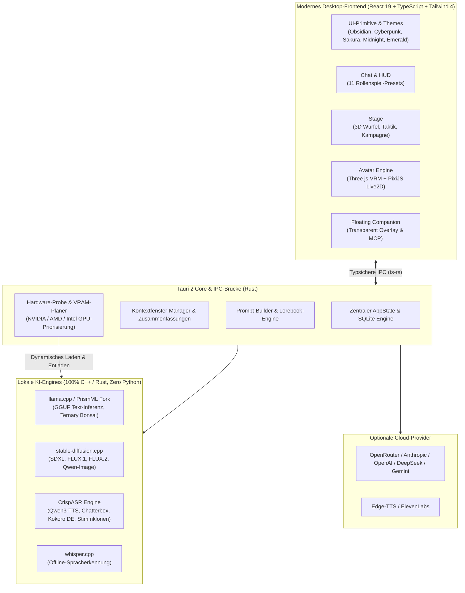
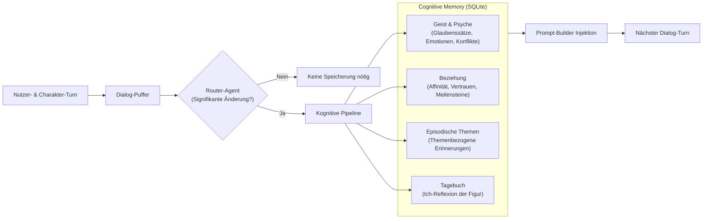

<p align="center">
  
</p>

<p align="center">
  <a href="README.md">🇬🇧 English</a> •
  <a href="README.de.md"><strong>🇩🇪 Deutsch</strong></a> •
  <a href="README.ru.md">🇷🇺 Русский</a>
</p>

<p align="center">
  <strong>Persönliche KI-Gefährten. Lebendige 3D- & 2D-Avatare. Bleibende Erinnerungen. Pen & Paper Tabletop-Engine.</strong><br>
  <em>Die native, lokale Desktop-Plattform für tiefgründiges Rollenspiel, immersive Geschichten und intelligente Desktop-Begleiter.</em>
</p>

<p align="center">
  <a href="https://github.com/SnowwhiteOakheart/OtakuSoul"></a>
  
  
  
  
  
  
  
</p>

<p align="center">
  <a href="#-warum-otakusoul">Warum OtakuSoul?</a> •
  <a href="#-highlights-im-überblick">Highlights</a> •
  <a href="#-impressionen--feature-tour">Feature-Tour & Screenshots</a> •
  <a href="#-system--kognitions-architektur">Architektur</a> •
  <a href="#-geprüfte-hardware-performance">Hardware-Performance</a> •
  <a href="#-installation--schnellstart">Installation</a> •
  <a href="#-technologie-stack">Technologie</a>
</p>

---

## 🌌 Warum OtakuSoul?

Herkömmliche Chat-Oberflächen behandeln Charaktere oft wie austauschbare Prompts: Sobald das Kontextfenster voll ist oder das Chatfenster schließt, verblasst die Persönlichkeit.

**OtakuSoul bricht mit diesem Muster.** Entwickelt als hochperformante, native Desktop-App in **Rust (Tauri 2)** und **React 19**, erweckt OtakuSoul Charaktere zu echtem virtuellem Leben:

* 🧠 **Seelen, die sich erinnern:** Mit dem kognitiven **Memory (Gedächtnis)** entwickeln Charaktere ein echtes vierstufiges Gedächtnis – inklusive Überzeugungen, inneren Konflikten, veränderlichen Beziehungen und authentischen Tagebucheinträgen.
* 🎭 **Ausdrucksstarke Avatare:** Sieh deine Gefährten als **3D-VRM-** oder **Live2D-Modell**, das in Echtzeit mit 28 Emotionen, Blickbewegungen, Blinzeln und audio-gesteuertem LipSync reagiert.
* 🎲 **Vom Chat zum Pen-&-Paper-Abenteuer:** Mit der **Stage** verwandelt sich jedes Gespräch in eine vollwertige Tabletop-Kampagne. Ein zweistufiger KI-Game-Master führt Regie, während 3D-Würfelproben, Party-Gesundheit, Stress und Quests echte Spannung erzeugen.
* 🤖 **Ein echter Begleiter auf deinem Desktop:** Der **Companion** schwebt transparent über deinen Fenstern, besitzt einen neurohormonalen Biorhythmus, führt Desktop-Tools aus und verbindet sich über das **Model Context Protocol (MCP)** mit deiner Umgebung.
* 🔒 **100 % Local First & Privatsphäre:** Betreibe modernste Sprachmodelle (GGUF via llama.cpp/PrismML), Bildgenerierung (stable-diffusion.cpp) und Sprachausgabe (CrispASR) direkt offline auf deiner Grafikkarte. **Keine Python-Installation nötig, keine versteckten Telemetriedaten.** Und wenn du willst, stehen alle großen Cloud-Provider auf Knopfdruck bereit.

---

## ⚡ Highlights im Überblick

| Modul | Das Erlebnis |
|---|---|
| 💬 **Immersiver Chat** | Intelligentes Kontextfenster-Management mit automatischer Handlungssammenfassung älterer Turns, Swipes (`< 1/3 >`), Inline-Editor mit Schreibschutz-Entwürfen, Dateianhängen (Bilder, PDFs, Text), In-Chat-Übersetzung sowie Suche (Strg+F), Lesezeichen und „Ab hier als neuen Chat fortsetzen“ für lange Geschichten. |
| 🎭 **3D- & 2D-Avatare** | Native Unterstützung für **3D VRM 0.x/1.0**, **MMD-Modelle (PMX/PMD, mit VMD-Bewegungen und Haarphysik)**, **glTF/GLB-Avatare (Mixamo-artiges Rig, ARKit-Blendshapes)** und **Live2D Cubism 2/4** mit automatischer Emotionserkennung, Physics, Blicksteuerung und LipSync mit Mundformen (a/i/u/e/o) aus dem Stimmklang. Eigene **VRMA- oder Mixamo-FBX-Bewegungen** (Ruhe-Schleife, Winken, Nicken, Gefühle) spielen bei Rollenspiel-Aktionen wie *winkt*. Position und Zoom werden pro Figur gespeichert. |
| 🧠 **Cognitive Memory** | 4-Schichten-Gedächtnis (Geist & Psyche, Beziehungsdynamik, episodische Themen, Tagebuch). Autonome Router- und Archivist-Agenten reflektieren Dialoge, während automatische Snapshots für Datensicherheit sorgen. Jede Erinnerung zeigt ihre Herkunft und Quelle, lässt sich korrigieren, anheften oder vergessen und hat einen Verlauf; ändert sich die Quellnachricht, wird sie zur Prüfung markiert. |
| 🎲 **Stage (TTRPG)** | Volles Solo- und Party-Rollenspiel: 2-stufiger KI-Spielleiter, 3D-Würfel, dynamische NPCs, Weltzustand-Editor. Komplette Mehrsprachigkeit für Szenen und Lorebooks durch otakusoul_i18n. |
| 🌍 **Dynamische Mehrsprachigkeit** | Das gesamte Backend ist auf dynamische JSON-Locales (z.B. otakusoul-data/locales) umgestellt. Neue Sprachen (z.B. Spanisch, Japanisch) können durch Ablegen einer JSON-Datei hinzugefügt werden, ohne den Code neu kompilieren zu müssen. |
| 🤖 **Companion (Desktop-Agent)** | Schwebendes, transparentes Always-on-Top-Overlay mit Click-Through, Neurohormonen (Dopamin, Cortisol, Oxytocin, Erschöpfung), echtem Desktop-Tool-Zugriff (Websuche, Screenshots, Zwischenablage, Skripte) und 25s Human-in-the-Loop-Sicherheitsbanner. |
| 🎙️ **Next-Gen Audio & TTS** | 100 % lokal ohne Python über CrispASR: Qwen3-TTS (10 Sprachen), Chatterbox (23 Sprachen), deutsches Kokoro 82M, **Stimme per Beschreibung** (Qwen3-TTS VoiceDesign), TADA 3B (10 Sprachen), Chatterbox Turbo mit hörbarem Lachen und Seufzen und echtes **Stimmklonen** aus 5–15s Audio. Dazu Edge-TTS, ElevenLabs und lokale Whisper-Spracherkennung. |
| 🖼️ **Lokale Bildgenerierung** | Offline-Bilder mit stable-diffusion.cpp (SD 1.5 für 4-GB-Karten, SDXL, FLUX.1, Qwen-Image, FLUX.2), dazu Anime-LoRAs passend zur Modellfamilie. Intelligenter VRAM-Planer entlädt bei Bedarf gestuft Sprach- und Chatmodelle und startet sie nach dem Generieren automatisch wieder. |
| 🌐 **Community Hub** | Direkte Chub AI-Integration mit automatischer Lorebook-Extraktion, SillyTavern-V2-Kartenimport/-export, Lorebook 2.0 mit Spannungs-Triggern und Abhängigkeitsketten sowie geführter 5-Schritte KI-Charakter-Wizard. |
| 📱 **Mobiler Web-Client** | Chatte im selben WLAN direkt vom Smartphone oder Tablet: Integrierter Axum-Server mit Vektor-QR-Code, Token-Authentifizierung und DNS-Rebinding-Schutz. |
| 🎨 **Design & Barrierefreiheit** | 5 lebendige Themes (Obsidian, Cyberpunk, Sakura, Midnight, Emerald), flächendeckende Mehrsprachigkeit (DE, EN, RU), Barrierefreiheit (WCAG AA), globale Befehlspalette (`Strg+K`) und virtualisierte High-Speed-Listen. |

---

## 📸 Impressionen & Feature-Tour

### 1. Lebendige Konversationen & 3D/2D-Avatare
Tausche dich mit deinen Charakteren in einer stimmungsvollen Chat-Oberfläche aus. Der 3D-VRM- oder Live2D-Avatar reagiert dynamisch auf jede Äußerung, während das flexible Rollenspiel-HUD wichtige Variablen wie Zuneigung, Energie und Laune visualisiert.

<p align="center">
  
</p>

* **Audio-synchronisierter LipSync:** Das Sprachmodell steuert über TTS die Lippenbewegungen der Figur exakt zur gesprochenen Stimme.
* **Nie wieder Kontextverlust:** Wird das Modell-Kontextfenster knapp, fasst ein Hintergrundprozess ältere Dialoge als prägnante „Bisherige Handlung“ zusammen – jederzeit einsehbar und editierbar.
* **Kompakte Ansicht:** Ein Schalter verdichtet Nachrichten und Leisten, die Zustandswerte im HUD lassen sich einklappen – beides merkt sich die App.
* **Stimmeffekte:** Roboter, Funk, Geist, Höhle, Tief oder Fee – oder eigene Werte für Tonhöhe, Hall, Echo und Filter, für jede Sprach-Engine.
* **Gestaltung pro Chat:** Eigenes Hintergrundbild, Textgröße, Blasenstil und ein Ambient-Klang mit Lautstärke – je Chat gespeichert, Bilder und Klänge teilen sich die Bibliothek mit der Stage.
* **Werkzeuge im Chat:** Auf Wunsch nutzt das Modell Datum/Uhrzeit, einen Rechner und die Websuche – mit jedem Anbieter und lokalen Modellen; die Nutzung steht im Gedankenblock.
* **Hintergrundaufgaben im Blick:** Downloads, Reflexion, Zusammenfassungen, Bilder und das Laden des Modells erscheinen in einer Aufgabenliste im Kopf – mit Fortschritt, Wartegrund (z. B. „Chat-Modell wird entladen“), Fehlerursache, Abbrechen und Wiederholen.
* **Resiliente Interaktion:** Ausführliche Antwortvarianten (Swipes), Inline-Korrekturen und automatische Entwurfssicherung schützen vor Datenverlust bei Verbindungsabbrüchen.
* **Verlässliche Chat-Editoren:** Titel, Author's Note und Zusammenfassung melden Speicherfehler und erhalten Entwürfe zum Wiederholen. Notiz- und Zusammenfassungsentwürfe bleiben beim Schließen der Seitenleiste und beim Chatwechsel getrennt erhalten, solange die Chatansicht geöffnet bleibt.
* **Sichtbare Memory-Lesefehler:** Übersicht und Snapshot-Liste behalten bereits geladene Daten und zeigen Ladefehler mit Wiederholen an. Ein erfolgreiches Speichern bleibt erfolgreich, auch wenn das anschließende Nachladen scheitert.
* **Verlässlicher Import & Wiederherstellung:** SoW-Import und Snapshot-Wiederherstellung rollen Datenbankänderungen bei Schreibfehlern vollständig zurück. Reflexionsfehler bleiben sichtbar; eine fehlgeschlagene Reflexion kann bereits Änderungen enthalten und wird mit entsprechendem Hinweis angezeigt.

---

### 2. Stage – Die interaktive Rollenspiel-Bühne
Erlebe interaktive Tabletop-Abenteuer wie mit einem menschlichen Spielleiter. Die Stage kombiniert erzählerische Tiefe mit verlässlichen Pen-&-Paper-Mechaniken.

<p align="center">
  
</p>

* **Zweistufiger KI-Game-Master:** Ein Planner-Modell entwirft Handlung und Herausforderungen; ein Executor-Modell lässt die Welt und Gefährten reagieren.
* **3D-animierte Würfelproben:** Proben auf Fertigkeiten mit Schwierigkeitsgraden (DC), dramatischen 3D-Würfelwürfen und audio-visuellen Effekten bei kritischen Treffern oder Patzern.
* **Szenen & Kampagnen:** Spiele vordefinierte Abenteuer wie alle 12 Kapitel von *No Game No Life* oder erstelle eigene Welten.
* **NPCs mit Gedächtnis & Beförderung:** Triff auf Händler, Wachen oder Schurken mit eigenen Erinnerungen – und befördere sie bei Gefallen direkt zu festen Gefährten der Gruppe!

<p align="center">
  
</p>

* **Volle Kontrolle über die Welt:** Der integrierte Weltzustand-Editor erlaubt das freie Anpassen von Fakten, Story-Arcs, Geheimnissen, Gruppenbeziehungen und Inventar.

---

### 3. Cognitive Memory – Charaktere mit echter Tiefe
Ein Charakter in OtakuSoul vergisst dich nicht. Nach Gesprächen analysiert eine autonome kognitive Pipeline das Geschehene und aktualisiert die verschiedenen Schichten des Gedächtnisses.

<p align="center">
  
</p>

* **Geist & Psyche:** Feste Glaubenssätze, momentane Gemütszustände, unbewusste Motive und kognitive Dissonanzen formen das Verhalten.
* **Beziehungsentwicklung:** Vertrauen, emotionale Nähe und gemeinsam gemeisterte Meilensteine wachsen organisch.
* **Tagebuch & Episoden:** Die Figur schreibt persönliche Tagebucheinträge aus ihrer eigenen Ich-Perspektive und reflektiert über das Erlebte.
* **Markdown-Transparenz:** Alle Schichten lassen sich im integrierten Editor als `MEMORY.md` und `USER.md` einsehen, bearbeiten und bidirektional synchronisieren.

---

### 4. Companion – Dein KI-Agent auf dem Desktop
Hole deinen Gefährten direkt auf deinen Arbeitsplatz. Als schwebendes, rahmenloses Fenster begleitet dich dein Charakter durch den Alltag.

<p align="center">
  
</p>

* **Transparentes Overlay & Click-Through:** Platziere deinen Avatar dezent auf dem Bildschirm, ohne dass er dich beim Arbeiten oder Spielen stört.
* **Biometrisches Hormonsystem:** Dopamin, Cortisol, Oxytocin und Erschöpfung simulieren Laune, Konzentration und Müdigkeit in Echtzeit.
* **Echte Desktop-Tools:** Dein Begleiter kann auf Wunsch das Web durchsuchen, Screenshots analysieren, Musik über MPRIS steuern oder Skripte ausführen.
* **Maximale Sicherheit:** Ein **25-Sekunden Human-in-the-Loop Countdown-Banner** verlangt deine explizite Zustimmung vor jeder sensiblen Aktion. Zudem schützt ein automatischer Datenschutzfilter Passwörter und Online-Banking.

---

### 5. Charakter-Studio, Lorebooks & Community Hub
Egal ob du eigene Figuren erschaffen oder auf eine gigantische Community-Bibliothek zugreifen möchtest: OtakuSoul fügt sich nahtlos in dein bestehendes Setup ein.

<p align="center">
  
</p>

<p align="center">
  
</p>

* **Vollständige SillyTavern-V2-Kompatibilität:** Importiere und exportiere Charakterkarten als PNG (mit eingebetteten Chara-Daten) oder JSON.
* **Geführter 5-Schritte KI-Wizard:** Erstelle aus einer vagen Idee in wenigen Schritten tiefgründige Charaktere mit Hintergrundgeschichte, Persönlichkeit und Begrüßung.
* **Chub AI Browser:** Durchsuche tausende Karten direkt in der App und extrahiere eingebettete Lorebooks automatisch.
* **Lorebook 2.0 Engine:** Reaktive Welt- und Wissensbücher mit kombinierbaren Triggern (ODER, UND, NICHT, Regex), Spannungs-Akkumulatoren und Aktivierungsketten.

---

## 🏛️ System- & Kognitions-Architektur

### 1. Technische System-Übersicht

OtakuSoul trennt Benutzeroberfläche, Inferenz-Steuerung und Hardware-Ressourcen sauber voneinander. Dank nativer C++/Rust-Engines wird **keine Python-Laufzeit** benötigt:



---

### 2. Kognitiver Memory-Ablauf

Jeder Gesprächsabschnitt durchläuft eine mehrstufige Reflexion, damit sich Figuren organisch weiterentwickeln:



---

## 📊 Geprüfte Hardware-Performance

OtakuSoul wurde auf echter Hardware auf Herz und Nieren geprüft. Die folgenden Werte wurden auf einem Referenzsystem (**NVIDIA GeForce RTX 4070 Ti SUPER, 16 GB VRAM**, Linux CUDA) ermittelt:

### Lokale Bildgenerierung (stable-diffusion.cpp)
Bildmodelle, LoRAs und Anbieter stellst Du unter **Einstellungen → Bilder** ein, Stimmen (Sprachausgabe, Spracherkennung, lokale Sprachmodelle) je Charakter unter **Einstellungen → Stimme** – zusammen mit dem Chat-Modell an einem Ort. Studio und Galerie liegen unter Integrationen.

Dank des intelligenten VRAM-Planers teilt sich die Bildgenerierung den Grafikspeicher nahtlos mit dem Sprachmodell:

| Modell | Generierungszeit | VRAM-Bedarf | VRAM-Verhalten |
|---|---|---|---|
| **Counterfeit V3.0** (SD 1.5) | ~15 s | ~2 GB Gewichte | Einstiegsstufe für 4-GB-Karten; was nicht passt, lagert sd.cpp aus |
| **Animagine XL 4.0** (SDXL) | ~28 s | ~7,6 GB | Läuft parallel neben verkleinertem Chat-Modell (44 GPU-Layer) |
| **FLUX.1 dev** (Q5_K_S) | ~48 s | ~9,0 GB | Läuft parallel neben Chat-Modell (26 GPU-Layer) |
| **Qwen-Image 2.1** (Q4_K) | ~73 s | ~5,6 GB | Paralleler Betrieb mit CPU-Offloading möglich |
| **FLUX.2 dev** (Q4_K_S) | ~248 s | ~14,4 GB | Gestufter VRAM-Tausch: Entlädt Chat-Modell und lädt es danach neu |

**LoRAs:** Ein geprüfter Katalog (Anime Detailer, Style Enhancer und Pastel Anime für SDXL, GHIBSKY für FLUX.1 – nur nicht-kommerziell) lädt per SHA-256 geprüft von Hugging Face; eigene Dateien im Ordner `loras` erscheinen ebenfalls. Jede LoRA wird mit Stärke gewählt und nur an Modelle ihrer Familie geschickt, Auslösewörter ergänzt die App selbst.

### Lokale Sprachausgabe & Stimmklonen (CrispASR)
Synthesezeiten und Verständlichkeit (gemessen via Whisper-Rückerkennung):

| Modell | Stimme / Modus | Deutsch | Russisch | Englisch | RTF (Real-Time Factor) | VRAM-Zuwachs |
|---|---|---|---|---|---|---|
| **Qwen3-TTS 0.6B** (CustomVoice) | Vivian / Ryan | 100 % | 90 % | 100 % | 0,12 – 0,13 (sehr schnell) | +2,3 – 3,2 GB |
| **Qwen3-TTS 1.7B Base** | **Eigener Stimmklon** (16–24 kHz) | 100 % | 100 % | 100 % | 0,15 (Echtzeit) | +3,3 – 3,6 GB |
| **Chatterbox Multilingual** | Standard-Stimme | 92 % | 70 % | – | 0,30 – 0,55 | +1,8 – 2,3 GB |
| **Kokoro DE** | Victoria / Bernd / Eva | 77 % | – | – | 0,06 – 0,23 (ultraschnell) | +1,0 – 1,8 GB |

> [!NOTE]
> Der lokale Chat steht nach jeder Bild- oder Sprachberechnung bereits nach 1–4 Sekunden wieder vollständig zur Verfügung!

---

## 📥 Installation & Schnellstart

OtakuSoul bietet für alle gängigen Betriebssysteme native Installer:

### 🐧 Linux (Debian, Ubuntu, Arch, Fedora u. a.)
* **Ein-Klick-Setup (empfohlen):**
  ```bash
  chmod +x install.sh && ./install.sh
  ```
  Installiert OtakuSoul nach `~/.local/bin/otakusoul`, richtet das hochauflösende App-Icon ein und erstellt den Menüeintrag im Desktop-Starter (GNOME, KDE, XFCE).
* **Debian / Ubuntu:**
  ```bash
  sudo dpkg -i OtakuSoul_0.3.0_amd64.deb
  ```
* **Arch Linux (AUR):**
  ```bash
  cd packaging/aur && makepkg -si
  ```
* **Portables AppImage:**
  ```bash
  chmod +x OtakuSoul_0.3.0_amd64.AppImage && ./OtakuSoul_0.3.0_amd64.AppImage
  ```

### 🪟 Windows (10 / 11)
* **PowerShell Schnell-Installer:**
  ```powershell
  powershell -ExecutionPolicy Bypass -File .\install.ps1
  ```
  Installiert OtakuSoul nach `%LOCALAPPDATA%\Programs\OtakuSoul\`, erstellt Startmenü- und Desktop-Icons und bietet den Sofortstart an.
* **Grafisches NSIS-Setup:** Führe einfach `OtakuSoul_0.3.0_x64-setup.exe` aus.

### 🍏 macOS (Apple Silicon & Intel)
* **Terminal-Installer:**
  ```bash
  chmod +x install-macos.sh && ./install-macos.sh
  ```
  Kopiert die App nach `/Applications`, entfernt Gatekeeper-Quarantäne-Flags und verknüpft sie mit Spotlight und Launchpad.
* **DMG-Image:** Öffne `OtakuSoul_0.3.0_universal.dmg` und ziehe OtakuSoul in deinen Programme-Ordner.

---

## 🛠️ Für Entwickler

### Voraussetzungen
* **Node.js** 20+ und `npm`
* **Rust** 1.78+ (`cargo`)
* *Linux:* WebKitGTK 4.1, GTK 3, libsoup 3, librsvg 2

### Entwicklungsumgebung starten
```bash
# Abhängigkeiten installieren
npm install

# Entwicklungsserver mit Hot-Reloading starten
npm run tauri dev

# Speziell für Linux (mit X11/WebKit-Optimierungen)
npm run tauri:linux
```

### Tests & Typsicherheit
```bash
# Alle lokalen Vorab-Checks (oxlint, tsc, vitest, cargo fmt, clippy, cargo test)
npm run check

# TypeScript-Typen aus Rust-Structs neu generieren (ts-rs)
npm run types:gen

# End-to-End Testsuite (baut nach target/e2e und testet alle Features gegen Mock-LLM)
npm run e2e

# Langchat-Performance-Messung (1000 Nachrichten)
npm run e2e:perf
```

---

## 🧰 Technologie-Stack

* **Desktop-Architektur:** [Tauri 2](https://tauri.app/) (sicher, leichtgewichtig, minimaler RAM-Verbrauch)
* **Backend:** [Rust](https://www.rust-lang.org/) mit [Tokio](https://tokio.rs/), [SQLite](https://sqlite.org/) via `rusqlite`, `reqwest` und `axum`
* **Frontend:** [React 19](https://react.dev/), [TypeScript](https://www.typescriptlang.org/), [Vite](https://vitejs.dev/) und [Tailwind CSS 4](https://tailwindcss.com/)
* **State Management:** [Zustand](https://github.com/pmndrs/zustand) mit partitionierten Slices
* **Avatar-Rendering:** [Three.js](https://threejs.org/) & [@pixiv/three-vrm](https://github.com/pixiv/three-vrm) für 3D; [PixiJS](https://pixijs.com/) & Live2D Cubism Core für 2D
* **Lokale KI-Ressourcen:** llama.cpp & PrismML (GGUF), stable-diffusion.cpp, CrispASR, whisper.cpp
* **Audio & Sprache:** Web Audio API mit Echtzeit-FFT-Analyse, CrispASR, Edge-TTS, ElevenLabs

---

## ⚖️ Lizenz & Ethik

OtakuSoul ist freie Software unter der **GNU General Public License v3.0 (GPLv3)**.

### Credits
OtakuSoul entstand als eigenständiger Rust/Tauri-Port und Neuentwurf des Python-Projekts [Soul of Waifu](https://github.com/jofizcd/Soul-of-Waifu) von [jofizcd](https://github.com/jofizcd) (GPLv3).

### KI-Modelle & Transparenz
OtakuSoul bündelt bewusst **keine** proprietären Modellgewichte im Quellcode oder Installer:
* Laufzeiten und Modelle werden ausschließlich transparent von ihren Originalquellen (z. B. Hugging Face) bezogen und per **SHA-256-Prüfsumme** verifiziert.
* Nicht-kommerzielle Modelle (z. B. FLUX.1 dev oder F5-TTS) sind standardmäßig gesperrt und müssen in den Einstellungen explizit vom Nutzer freigeschaltet werden.
* **Verantwortungsvolles Stimmklonen:** Das Klonen von Stimmen erfordert eine ausdrückliche Bestätigung der vorliegenden Einwilligung. Generierte Audiodateien werden über CrispASR mit einem digitalen Wasserzeichen versehen (**EU AI Act, Art. 50**).

---

<p align="center">
  <br>
  <em>Infinite Worlds. One Soul.</em>
</p>
