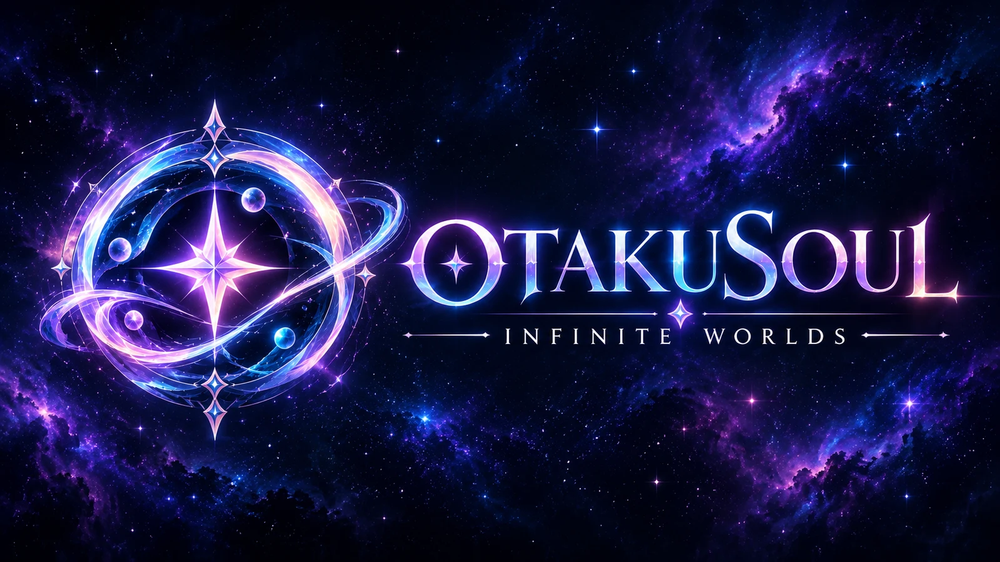

<p align="center">
  
</p>

<p align="center">
  <strong>Persönliche KI-Charaktere. Lebendige Avatare. Erinnerungen, die bleiben.</strong>
</p>

<p align="center">
  <a href="https://github.com/SnowwhiteOakheart/OtakuSoul"></a>
  
  
  
  
</p>

---

## Mehr als ein Chatbot

**OtakuSoul** ist eine immersive Desktop-Plattform für Menschen, die mit KI-Charakteren nicht nur Nachrichten austauschen, sondern gemeinsame Geschichten und Beziehungen entwickeln möchten.

Deine Charaktere können sich erinnern, ihre Gefühle und Beziehungen verändern, mit einer eigenen Stimme sprechen und als **3D-VRM**, **Live2D-Modell** oder klassisches Porträt sichtbar werden. Lokale GGUF-Modelle geben dir maximale Kontrolle und Privatsphäre; Cloud-Anbieter stehen bereit, wenn du mehr Reichweite oder spezialisierte Modelle brauchst.

Ob ruhiger Alltagsdialog, langfristige Charakterentwicklung oder eine dramatische Kampagne mit Würfeln, Zuständen und Konsequenzen: OtakuSoul verbindet all diese Ebenen in einer einzigen Anwendung.

<p align="center">
  
</p>

## Eine Seele für jede Geschichte

| | Erlebnis |
|---|---|
| 🧠 **Soul Memory** | Charaktere bauen langfristige Erinnerungen auf, reflektieren Erlebnisse und entwickeln ihre Beziehung zum Nutzer weiter. Psychologie, episodisches Gedächtnis, Beziehung und Tagebuch greifen ineinander. |
| ✨ **Lebendige Avatare** | VRM- und Live2D-Modelle reagieren mit Emotionen, Blickbewegungen, Blinzeln, Atmung und audio-gesteuertem LipSync. Position und Zoom bleiben pro Modell gespeichert. |
| 🎭 **Charaktere & KI-Assistent** | Importiere Tavern-/SillyTavern-Character-Cards, Personas und Lorebooks. Erstelle neue Figuren mit dem geführten 5-Schritte KI-Wizard. |
| 🌐 **Soul Hub & Gateways** | Stöbere im integrierten Community-Hub: Soul Gateway, Chub AI Browser mit automatischer Lorebook-Extraktion, Welt-Lorebooks und Soul-Stage-Szenarien. |
| 🎲 **Soul Stage** | Verwandle Gespräche in interaktive Abenteuer: Szenenordner (inkl. 12 Kapiteln *No Game No Life*), Multi-Akteur-Züge, Würfelproben, Kampagnen-Uhren, Initiative, dynamische Hintergründe mit Lock und zuverlässige Backups. |
| 🎙️ **Stimme & Sprache** | Nutze Edge-TTS, lokales Kokoro, ElevenLabs oder OpenAI-kompatible Stimmen. Aktionen und Regieanweisungen lassen sich gezielt vom gesprochenen Dialog trennen. |
| 🤖 **Soul Companion** | Echter Desktop-Agent mit transparentem Always-on-Top Floating-Overlay, Click-Through, Neurohormonen, proaktivem Ansprechen, echten Desktop-Tools, Sandbox, MCP-Client und 25s Human-in-the-Loop Sicherheitsbanner. |
| 📱 **Mobiler Web-Client** | Chatte vom Smartphone oder Tablet im selben WLAN: Autarker Axum-Server, Token-Auth, DNS-Rebinding-Schutz, Streaming und QR-Code-Direktscan. |
| 🎮 **Discord & Medien** | Discord Rich Presence (RPC) und nativer Gateway-Bot (`!ask`, `!character`, `!status`), sowie KI-Bildgenerierung (A1111, ComfyUI, DALL-E 3, NovelAI, FLUX) direkt aus dem Chat. |
| 🌍 **i18n, Themes & Diagnose** | Dreisprachig (`de`, `en`, `ru`), 5 lebendige Themes (Obsidian, Cyberpunk, Sakura, Midnight, Emerald), globale Befehlspalette (`Strg/Cmd+K`), rotierender File-Logger, Live-Log-Viewer und Update-Checker. |
| 💾 **Profil-Backups** | Portabler ZIP-Export mit Gruppen-Auswahl und 5-facher automatischer Sicherheits-Snapshot-Rotation vor jedem Restore. |
| 🔐 **Local First** | Betreibe GGUF-Modelle direkt auf deinem Rechner. OtakuSoul erkennt Hardware und VRAM, wählt sinnvolle Laufzeitparameter und verwaltet den lokalen `llama-server`. |

## Charaktere, die sich entwickeln

OtakuSoul behandelt eine Figur nicht als austauschbaren Prompt. Jede Unterhaltung kann Spuren hinterlassen:

- **Psychologie** hält emotionale Muster, Bedürfnisse und innere Konflikte fest.
- **Beziehungen** verändern sich durch Vertrauen, Nähe, Spannung und gemeinsam Erlebtes.
- **Episodische Erinnerungen** bewahren bedeutende Momente, ohne den Kontext mit jeder Nachricht neu aufzublähen.
- **Tagebucheinträge** lassen Charaktere Erlebnisse aus ihrer eigenen Perspektive reflektieren.
- **Lorebooks** bringen Personen, Orte, Regeln und Weltwissen genau dann in den Kontext, wenn sie gebraucht werden.

Ein integrierter Memory-Inspector macht diese Ebenen sichtbar und editierbar. Backups und Wiederherstellung geben dir Kontrolle über die Entwicklung deiner Figuren.

## Deine Welt, dein Modell

### Lokal

OtakuSoul startet und überwacht einen lokalen `llama-server`, erkennt verfügbare CPU-, RAM- und GPU-Ressourcen und hilft bei einer passenden Konfiguration. Der integrierte Modell-Hub unterstützt die Suche und den Download von GGUF-Modellen sowie die Erkennung gängiger Quantisierungen.

### Cloud

Für andere Anforderungen stehen mehrere Provider bereit, darunter OpenRouter, Anthropic, OpenAI, DeepSeek, Gemini, Mistral und benutzerdefinierte OpenAI-kompatible Endpunkte. Presets und erweiterte Sampling-Optionen erlauben den Wechsel zwischen schnellen Chats, kreativem Storytelling und fokussierter Logik.

## Avatare mit Ausdruck

Wähle die Darstellung, die zu deinem Charakter passt:

- **3D VRM** mit natürlicher Ruhepose, Emotion-Morphs, Physik und LipSync
- **Live2D** mit Bewegungen, Expressions, Blicksteuerung, Zoom und freier Positionierung
- **2D-Porträts** mit optionalen Bildern für sechs Stimmungen und weichem Morph-/Crossfade-Wechsel
- **28 Emotionen** mit deutsch- und englischsprachiger Erkennung

Ansicht, Größe und Position werden automatisch pro Modell gespeichert. So erscheint ein Charakter beim nächsten Start genau dort, wo du ihn platziert hast.

## Geschichten werden zum Spiel

Mit **Soul Stage** wird aus Rollenspiel-Chat eine steuerbare Kampagne. Ein mehrstufiger Game-Master-Ablauf verbindet Erzählung und deterministische Mechanik: Würfelwürfe, Schwierigkeitsgrade und Zustandsänderungen werden nachvollziehbar ausgewertet, während die KI daraus eine zusammenhängende Szene gestaltet.

Szenenordner (inklusive aller 12 Kapitel unseres *No Game No Life* Abenteuers), modale Spielstand-Wahl (Fortsetzen vs. Neu starten), rotierende Sicherheits-Backups, Inline-Nachrichtenbearbeitung, Multi-Akteur-Züge, atmosphärische Hintergründe mit Lock-Option, Party-HUD, taktische Begegnungen und ein exportierbares Abenteuerprotokoll machen OtakuSoul zu einer flexiblen Bühne für Solo-Rollenspiel und charaktergetriebene Geschichten.

## Ein echter Begleiter auf deinem Desktop

Mit **Soul Companion** wird dein Lieblingscharakter zu einem echten Assistenten im Desktop-Alltag:

- **Schwebendes Overlay:** Ein rahmenloses, transparentes Fenster (`always_on_top`) begleitet dich beim Arbeiten oder Spielen, inklusive nativer Click-Through-Umschaltung.
- **Emotionen & Biorhythmus:** Neurohormone (Dopamin, Cortisol, Oxytocin, Erschöpfung) modellieren Laune, Müdigkeit und Einsamkeit, aus denen fließend 10 Emotionen abgeleitet werden.
- **Gedankenspeicher & Ziele:** Dein Begleiter führt ein persistentes Scratchpad für eigene Überlegungen und erinnert dich an Versprechen und Verabredungen.
- **Echte Werkzeuge & Schutz:** Websuche (DuckDuckGo), Screenshot-Erfassung (`xcap`), Zwischenablage, MPRIS-Mediensteuerung, App-Verwaltung, isolierte Multiplattform-Skript-Sandbox (PowerShell, Bash, Batch, optional Python 3) und Datei-Organisation – geschützt durch einen 25s Human-in-the-Loop Countdown-Banner für sensible Aktionen und automatischen Datenschutzfilter für Passwörter & Banking.
- **Model Context Protocol (MCP) & Plugins:** Verbinde beliebige MCP-Server (stdio oder HTTP/SSE) und führe benutzerdefinierte Skripte direkt als Tools aus.

## Offen für dein bestehendes Ökosystem

OtakuSoul unterstützt unter anderem:

- Tavern- und SillyTavern-Character-Card V2 als PNG oder JSON
- Geführter 5-Schritte KI-Charakterassistent (Wizard) zur automatischen Kartengenerierung
- Chub AI Kartenimport inkl. automatischer Extraktion eingebetteter Lorebooks (`character_book`)
- SillyTavern- und Soul-of-Waifu-Chatimporte
- Lorebooks und World-Info-Strukturen mit Chain-Dependencies und Tension-Trigger
- Soul-Stage-Szenarien und Szenenordner (JSON-Import/Export)
- Model Context Protocol (MCP) Server (stdio & HTTP/SSE) sowie Skript-Plugins
- Lokaler Axum Webserver für mobile Endgeräte (iOS Safari / Android) mit QR-Code
- Discord Rich Presence (RPC) und Discord Gateway WebSocket Bot
- KI-Bildgenerierung via Automatic1111, ComfyUI, DALL-E 3, NovelAI und FLUX
- Vollständige ZIP-Profil-Sicherung & Restore mit 5-facher Sicherheits-Snapshot-Rotation
- GGUF-Modelle für lokale Inferenz
- VRM 0.x/1.0 und Live2D Cubism 2/4
- Edge-TTS, Kokoro, ElevenLabs und OpenAI-kompatible Sprachdienste
- lokale Whisper- und OpenAI-kompatible Transkription

## Installation & Start

Wähle die passende Installationsmethode für dein Betriebssystem:

### 🐧 Linux
- **Ein-Klick-Installer & Launcher-Setup:**
  ```bash
  chmod +x install.sh && ./install.sh
  ```
  Installiert OtakuSoul nach `~/.local/bin/otakusoul`, richtet das 512x512 App-Icon ein, legt die `.desktop`-Verknüpfung für dein Anwendungsmenü (GNOME, KDE, XFCE etc.) an und macht es sofort über das Startmenü oder per CLI-Befehl `otakusoul` startbar.
- **Paket-Installationen:**
  - **Debian / Ubuntu:** `sudo dpkg -i OtakuSoul_0.1.0_amd64.deb`
  - **Arch Linux (AUR):** `cd packaging/aur && makepkg -si`
  - **Portables AppImage:** `chmod +x OtakuSoul_0.1.0_amd64.AppImage && ./OtakuSoul_0.1.0_amd64.AppImage`

### 🪟 Windows (10 / 11)
- **PowerShell Installer & Shortcut-Setup:**
  ```powershell
  powershell -ExecutionPolicy Bypass -File .\install.ps1
  ```
  Installiert OtakuSoul nach `%LOCALAPPDATA%\Programs\OtakuSoul\`, erstellt Verknüpfungen mit dem nativen App-Icon im Windows-Startmenü sowie auf dem Desktop und bietet den Direktstart an.
- **NSIS Setup (.exe):** Führe den grafischen Installer `OtakuSoul_0.1.0_x64-setup.exe` aus.

### 🍏 macOS (Intel & Apple Silicon)
- **macOS Installer & App-Setup:**
  ```bash
  chmod +x install-macos.sh && ./install-macos.sh
  ```
  Installiert `OtakuSoul.app` nach `/Applications`, bereinigt Gatekeeper-Quarantäne-Attribute und macht OtakuSoul über Launchpad, Spotlight und Dock startbar.
- **DMG Installer:** Die Datei `OtakuSoul_0.1.0_universal.dmg` öffnen und OtakuSoul in den `Applications`-Ordner ziehen.

## Schnellstart für Entwickler

### Voraussetzungen

- Node.js 20 oder neuer
- Rust 1.78 oder neuer
- Linux: WebKitGTK 4.1, GTK 3, libsoup 3 und librsvg 2

### Entwicklungsmodus

```bash
npm install
npm run tauri dev
```

### Tests ausführen

```bash
# Frontend Unit-Tests (Vitest)
npm run test

# Backend Tests (Cargo)
cd src-tauri && cargo test
```

### Produktions-Build & Paketierung

```bash
# Standard Tauri Build
npm run tauri build

# Linux Pakete (AppImage, deb)
./packaging/scripts/build-linux-packages.sh
```

### Optionale PrismML-/Bonsai-Laufzeit unter Linux

Kompakte `PQ2_0`- und `PTQ1_0`-Modelle benötigen die separate PrismML-Laufzeit. OtakuSoul hält sie von der normalen llama.cpp-Installation getrennt und wählt sie nur für passende Modelle aus:

```bash
./tools/install_prism_runtime.sh
```

## Technologie

- **Desktop:** Tauri 2
- **Backend:** Rust, Tokio, SQLite und reqwest
- **Frontend:** React 19, TypeScript, Vite und Tailwind CSS 4
- **UI-System:** Theme-fähige, barrierefrei getestete Primitive für Buttons, Tabs, Auswahlfelder, Schalter, Slider, Dialoge und Feedback
- **Avatare:** Three.js, `@pixiv/three-vrm`, PixiJS und Live2D Cubism
- **Lokale KI:** llama.cpp-kompatibler Server und GGUF
- **Audio:** Web Audio, Edge-TTS, Kokoro und whisper.cpp

Die native Rust-Basis hält die Anwendung kompakt und reaktionsschnell, während die WebGL-Oberfläche Raum für ausdrucksstarke Avatare und ein modernes, atmosphärisches Interface schafft.

## Projektstatus

OtakuSoul befindet sich in aktiver Entwicklung. Datenformate, Bedienabläufe und einzelne Schnittstellen können sich bis zu einer stabilen Veröffentlichung noch verändern. Backups wichtiger Charaktere und Erinnerungen werden empfohlen.

Beiträge, Fehlermeldungen und nachvollziehbare Verbesserungsvorschläge sind willkommen.

## Lizenz

OtakuSoul ist freie Software unter der **GNU General Public License v3.0**.

Entwickelt von **SnowwhiteOakheart**.

<p align="center"><em>Infinite Worlds. One Soul.</em></p>
