<p align="center">
  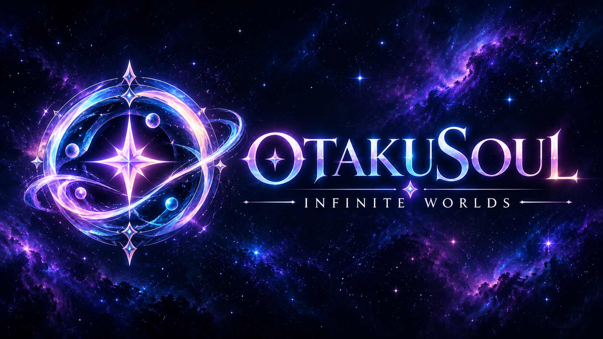
</p>

<p align="center">
  <a href="README.md"><strong>🇬🇧 English</strong></a> •
  <a href="README.de.md">🇩🇪 Deutsch</a> •
  <a href="README.ru.md">🇷🇺 Русский</a>
</p>

<p align="center">
  <strong>Personal AI Companions. Lifelike 3D & 2D Avatars. Enduring Memories. Pen & Paper Tabletop Engine.</strong><br>
  <em>The native, local-first desktop platform for deep roleplay, immersive storytelling, and intelligent desktop companions.</em>
</p>

<p align="center">
  <a href="https://github.com/SnowwhiteOakheart/OtakuSoul"></a>
  
  
  
  
  
  
  
</p>

<p align="center">
  <a href="#-why-otakusoul">Why OtakuSoul?</a> •
  <a href="#-highlights-at-a-glance">Highlights</a> •
  <a href="#-feature-tour--screenshots">Feature Tour</a> •
  <a href="#-system--cognitive-architecture">Architecture</a> •
  <a href="#-hardware-performance-benchmarks">Hardware Benchmarks</a> •
  <a href="#-installation--quick-start">Installation</a> •
  <a href="#-technology-stack">Technology Stack</a>
</p>

---

## 🌌 Why OtakuSoul?

Standard chat interfaces often treat characters as disposable prompts: as soon as the context window fills up or the window closes, personality fades away.

**OtakuSoul breaks this mold.** Built as a high-performance native desktop application in **Rust (Tauri 2)** and **React 19**, OtakuSoul brings characters to authentic virtual life:

* 🧠 **Souls That Remember:** With multi-tiered **Cognitive Memory**, characters develop persistent, four-layer recollections — including core beliefs, internal conflicts, evolving relationships, and first-person diary reflections.
* 🎭 **Expressive Avatars:** Watch and interact with companions as **3D VRM** or **Live2D** avatars reacting in real-time with 28 facial emotions, eye tracking, natural blinking, and audio-driven lip sync.
* 🎲 **From Chat to Tabletop Roleplay:** The **Stage** transforms any conversation into a full tabletop RPG campaign. A two-stage AI Game Master orchestrates the narrative, while 3D dice rolls, party vitals, stress, and quests produce genuine suspense.
* 🤖 **A True Desktop Companion:** The **Companion** floats borderless and semi-transparent above your windows, driven by a neurohormonal biorhythm, executing desktop tools, and interfacing with your system via the **Model Context Protocol (MCP)**.
* 🔒 **100% Local-First & Private:** Run modern open LLMs (GGUF via llama.cpp/PrismML), image generation (stable-diffusion.cpp), and speech synthesis (CrispASR) fully offline on your own GPU. **No Python setup required, zero hidden telemetry.** And whenever desired, top cloud providers connect with a single click.

---

## ⚡ Highlights at a Glance

| Module | What You Experience |
|---|---|
| 💬 **Immersive Chat** | Smart context management with automatic background summarization of older turns into ongoing narrative lore, response swipe navigation (`< 1/3 >`), inline editing with draft preservation, file attachments (images, PDFs, text), inline translations, search (Ctrl+F), bookmarks, and branch-off chat continuations. |
| 🎭 **3D & 2D Avatars** | Native support for **3D VRM 0.x/1.0**, **MMD models (PMX/PMD, with VMD motions and hair physics)**, **glTF/GLB avatars (Mixamo-style rig, ARKit blendshapes)** and **Live2D Cubism 2/4** featuring emotion detection, hair/cloth physics, eye gaze tracking, and lip sync with mouth shapes (a/i/u/e/o) taken from the voice. Your own **VRMA or Mixamo FBX motions** (idle loop, waving, nodding, emotions) play on roleplay actions like *waves*. Position and zoom persist per character. |
| 🧠 **Cognitive Memory** | 4-layer memory (Mind & Psyche, Relationship Dynamics, Episodic Memories, First-Person Diary). Autonomous Router and Archivist agents reflect on conversations, while automatic snapshots guarantee data safety. Every memory tracks its source, supports editing, pinning, or forgetting, and highlights when source messages change. |
| 🎲 **Stage (TTRPG Engine)** | Solo and party tabletop roleplay: dual-stage AI GM, 3D animated dice, dynamic NPCs, and an interactive world state editor. Full multi-language support for scenes and lorebooks via otakusoul_i18n. |
| 🌍 **Dynamic Localization** | Backend powered by hot-swappable JSON locales (`otakusoul-data/locales`). New community translations can be added simply by dropping JSON files without recompilation. |
| 🤖 **Companion (Desktop Agent)** | Floating, transparent always-on-top overlay with click-through, neurohormones (dopamine, cortisol, oxytocin, fatigue), desktop tool access (web search, screen capture, clipboard, shell scripts), and a 25s Human-in-the-Loop confirmation banner. |
| 🎙️ **Next-Gen Audio & TTS** | 100% offline without Python via CrispASR: Qwen3-TTS (10 languages), Chatterbox (23 languages), German Kokoro 82M, **voices from a description** (Qwen3-TTS VoiceDesign), TADA 3B (10 languages), Chatterbox Turbo with audible laughs and sighs and **voice cloning** from 5–15s audio samples. Cloud providers (Edge-TTS, ElevenLabs) and local Whisper speech recognition included. |
| 🖼️ **Local Image Generation** | Offline image rendering via stable-diffusion.cpp (SD 1.5 for 4 GB GPUs, SDXL, FLUX.1, Qwen-Image, FLUX.2), paired with matching anime LoRAs. An intelligent VRAM scheduler unloads chat models in steps when video memory is tight and restarts them seamlessly afterwards. |
| 🌐 **Community Hub** | Integrated Chub AI browser with automated lorebook extraction, SillyTavern V2 card import/export (PNG/JSON), Lorebook 2.0 with tension triggers and dependency chains, plus a guided 5-step AI character creation wizard. |
| 📱 **Mobile Web Client** | Chat from your phone or tablet on the same Wi-Fi: built-in Axum web server with vector QR code pairing, token authentication, and DNS-rebinding protection. |
| 🎨 **Design & Accessibility** | 5 built-in themes (Obsidian, Cyberpunk, Sakura, Midnight, Emerald), multi-language coverage (EN, DE, RU), WCAG AA accessibility, global command palette (`Ctrl+K`), and high-speed virtualized lists. |

---

## 📸 Feature Tour & Screenshots

### 1. Lifelike Conversations & 3D/2D Avatars
Engage with your characters in an atmospheric chat interface. The 3D VRM or Live2D avatar dynamically mirrors emotions, while an interactive RPG HUD displays affinity, energy, and mood indicators.

<p align="center">
  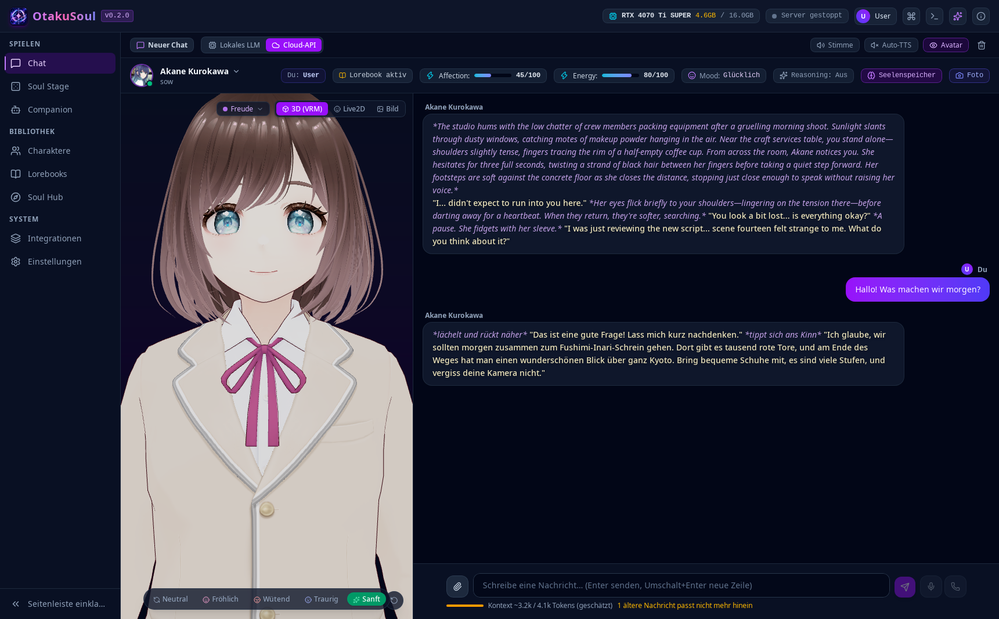
</p>

* **Audio-Synchronized Lip Sync:** Voice models animate avatar mouth shapes precisely to the spoken waveforms in real time.
* **Zero Context Amnesia:** When model context fills up, a background engine condenses older turns into a concise "Story So Far" narrative summary, fully editable at any point.
* **Compact Density View:** Toggle between standard and compact UI layouts; HUD metrics can be collapsed to minimize screen clutter.
* **Voice Effects:** Robot, radio, ghost, cave, deep or fairy – or your own pitch, reverb, echo and filter values, for every speech engine.
* **Per-Chat Style:** Own background picture, text size, bubble style and an ambient sound with volume – stored per chat, sharing pictures and sounds with the Stage library.
* **Chat Tools:** On request the model can use date/time, a calculator and web search – with every provider and local models; tool use shows up in the reasoning block.
* **Unified Background Tasks:** Downloads, memory reflection, image generation, and model initialization appear in a centralized task header with progress bars, wait explanations, cancel, and retry actions.
* **Resilient Editing & Protection:** Response variants (swipes), inline message corrections, and automatic draft storage safeguard your stories against crashes or disconnects.

---

### 2. Stage – Interactive Tabletop Roleplay
Step into tabletop campaigns led by an adaptive AI Game Master. The Stage combines rich narrative prose with tangible Pen & Paper mechanics.

<p align="center">
  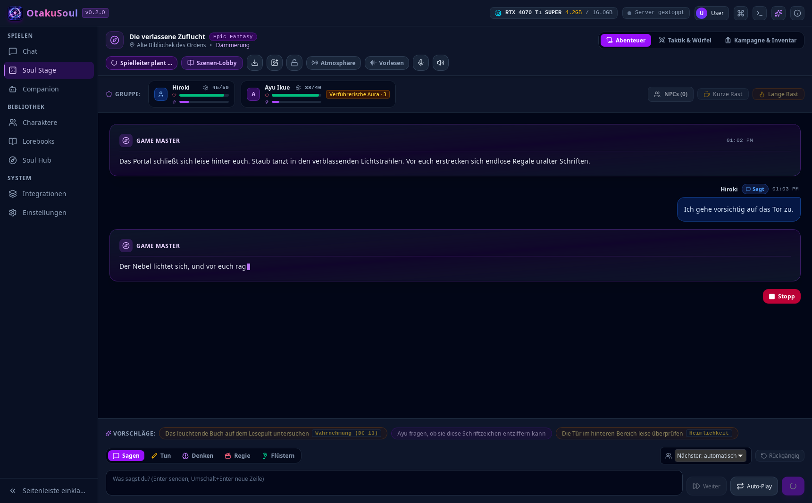
</p>

* **Two-Stage AI Game Master:** A Planner model designs plot beats and challenges; an Executor model renders world reactions and companion responses.
* **3D Animated Dice Rolls:** Skill checks against Difficulty Classes (DC), physical 3D dice simulations, and audiovisual flair for critical successes and fumbles.
* **Scenes & Campaigns:** Play preloaded modules like all 12 chapters of *No Game No Life* or craft custom universes from scratch.
* **NPCs with Memory & Promotion:** Encounter vendors, guards, or rivals with persistent memories — and recruit them into your permanent party!
* **5e-compatible fights (SRD 5.1):** Optionally a rules engine decides every roll, hit and enemy turn while the Game Master only narrates — with classes, SRD monsters and a tactical battle map (movement, line of sight, ranges, opportunity attacks).

<p align="center">
  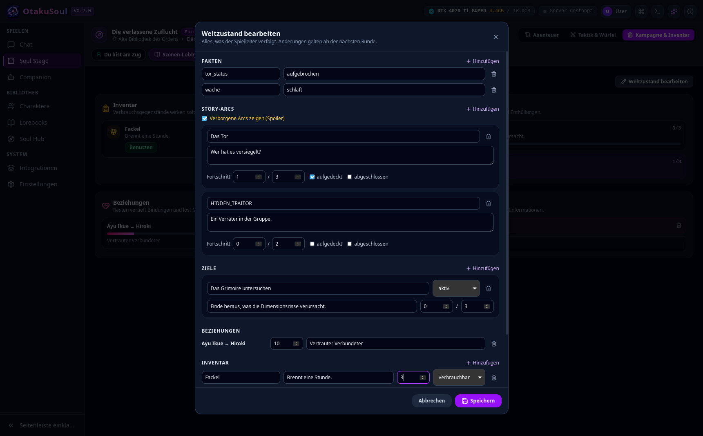
</p>

* **Complete World Control:** The built-in World State Editor allows modifying facts, ongoing story arcs, secrets, party relationships, and party inventories on the fly.

---

### 3. Cognitive Memory – Characters with Depth
A companion in OtakuSoul never resets into a stranger. Following chats, an autonomous cognitive pipeline analyzes interactions and updates memory strata.

<p align="center">
  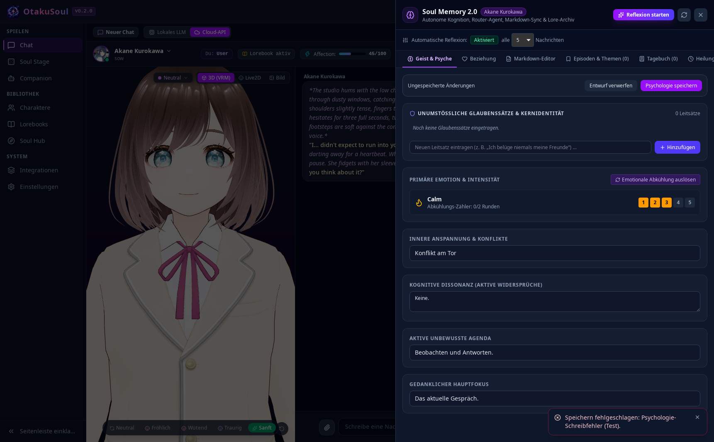
</p>

* **Mind & Psyche:** Fundamental beliefs, transient emotions, subconscious motives, and cognitive dissonances shape character behavior.
* **Relationship Evolution:** Trust, emotional intimacy, and shared milestones develop organically over time.
* **Diary & Episodes:** Characters write private first-person diary reflections evaluating recent events and feelings.
* **Markdown Transparency:** Inspect, edit, and synchronize all memory layers directly in markdown format via `MEMORY.md` and `USER.md`.

---

### 4. Companion – AI Agent on Your Desktop
Bring your companion straight onto your desktop. As a floating, borderless window, your character accompanies your daily workflow.

<p align="center">
  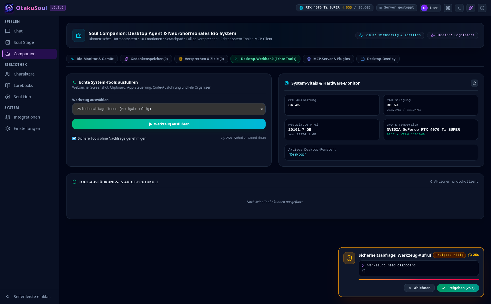
</p>

* **Transparent Overlay & Click-Through:** Place your avatar anywhere across your screen without interfering with gaming or productivity.
* **Biometric Hormonal System:** Dopamine, cortisol, oxytocin, and fatigue fluctuate to simulate focus, vitality, and mood realistically.
* **Desktop Tool Access:** Companions can search the web, analyze screen captures, control media via MPRIS, or run scripts upon request.
* **Human-in-the-Loop Safety:** A **25-second countdown banner** prompts for your explicit confirmation before executing sensitive actions, backed by privacy filters for passwords and banking views.

---

### 5. Character Studio, Lorebooks & Community Hub
Craft new characters from scratch or tap into vast community card repositories.

<p align="center">
  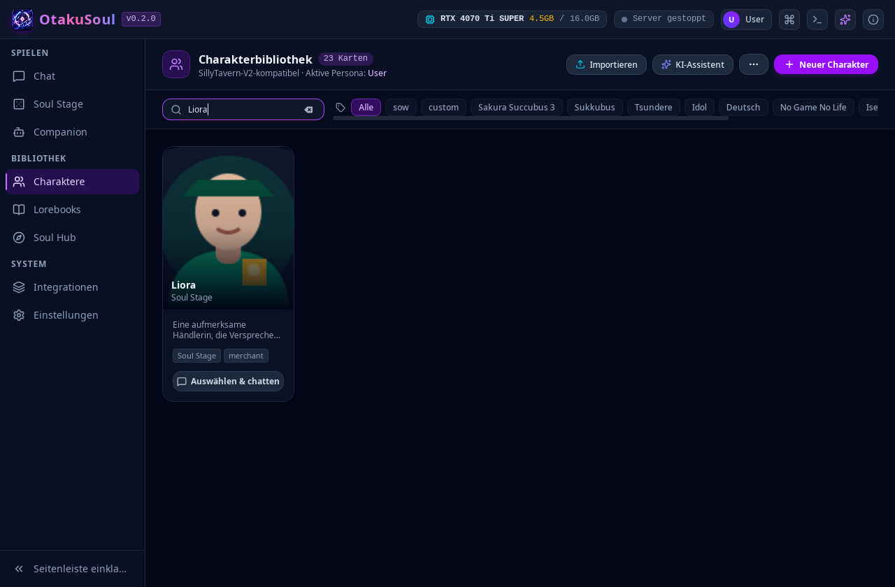
</p>

<p align="center">
  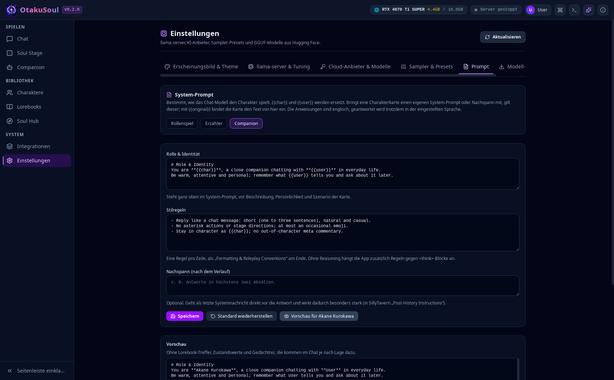
</p>

* **Full SillyTavern V2 Compatibility:** Import and export character cards in PNG (embedded chunks) or JSON formats.
* **Guided 5-Step AI Wizard:** Turn an initial concept into an intricate character with backstory, personality, and greeting scenarios.
* **Chub AI Browser:** Explore thousands of community cards inside the app and extract embedded lorebooks automatically.
* **Lorebook 2.0 Engine:** Reactive encyclopedias with combinable trigger rules (AND, OR, NOT, Regex), tension accumulators, and activation cascades.

---

## 🏛️ System & Cognitive Architecture

### 1. High-Level Technical Architecture

OtakuSoul maintains strict decoupling between UI rendering, inference orchestration, and hardware scheduling. Native C++ and Rust engines eliminate all **Python dependencies**:

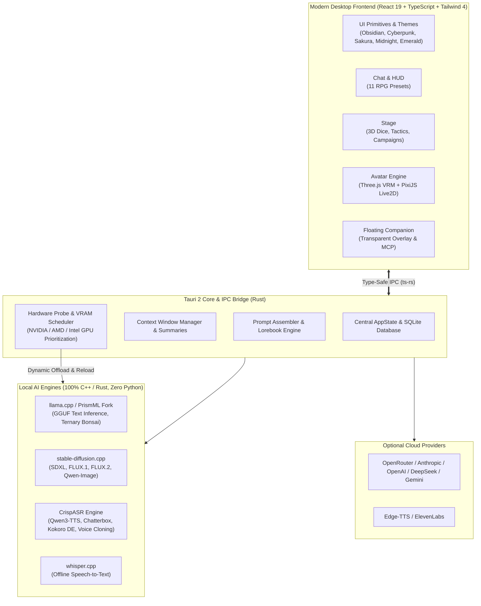

---

### 2. Cognitive Memory Workflow

Every conversational segment passes through multi-tier reflection, ensuring organic character development:

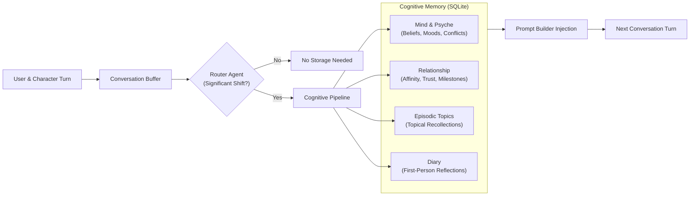

---

## 📊 Hardware Performance Benchmarks

OtakuSoul is tested on real bare-metal hardware. The measurements below were taken on a reference system (**NVIDIA GeForce RTX 4070 Ti SUPER, 16 GB VRAM**, Linux CUDA):

### Local Image Generation (stable-diffusion.cpp)
Configure image models and LoRAs under **Settings → Images**, and voices per character under **Settings → Voice**.

Thanks to the intelligent VRAM planner, image generation dynamically shares GPU memory with active language models:

| Model | Generation Time | VRAM Consumption | Memory Management |
|---|---|---|---|
| **Counterfeit V3.0** (SD 1.5) | ~15 s | ~2 GB weights | Ideal baseline for 4 GB GPUs; overflow pages cleanly to RAM |
| **Animagine XL 4.0** (SDXL) | ~28 s | ~7.6 GB | Runs alongside a resized chat model (44 GPU layers) |
| **FLUX.1 dev** (Q5_K_S) | ~48 s | ~9.0 GB | Runs alongside active chat model (26 GPU layers) |
| **Qwen-Image 2.1** (Q4_K) | ~73 s | ~5.6 GB | Concurrent execution with CPU offloading support |
| **FLUX.2 dev** (Q4_K_S) | ~248 s | ~14.4 GB | Stepped VRAM rotation: temporarily offloads chat model and restores it |

**LoRAs:** Tested community weights (Anime Detailer, Style Enhancer, Pastel Anime for SDXL, GHIBSKY for FLUX.1) download automatically with SHA-256 verification. Custom `.safetensors` files placed in the `loras/` directory are auto-detected.

### Speech Synthesis & Voice Cloning (CrispASR)
Synthesis speed and speech clarity (validated via Whisper reverse-transcription):

| Model | Voice / Mode | German | Russian | English | RTF (Real-Time Factor) | VRAM Delta |
|---|---|---|---|---|---|---|
| **Qwen3-TTS 0.6B** (CustomVoice) | Vivian / Ryan | 100% | 90% | 100% | 0.12 – 0.13 (Ultra-fast) | +2.3 – 3.2 GB |
| **Qwen3-TTS 1.7B Base** | **Custom Voice Clone** (16–24 kHz) | 100% | 100% | 100% | 0.15 (Real-time) | +3.3 – 3.6 GB |
| **Chatterbox Multilingual** | Standard Voice | 92% | 70% | – | 0.30 – 0.55 | +1.8 – 2.3 GB |
| **Kokoro DE** | Victoria / Bernd / Eva | 77% | – | – | 0.06 – 0.23 (Instantaneous) | +1.0 – 1.8 GB |

> [!NOTE]
> Local chat inference is fully restored within 1–4 seconds after an image or voice generation run finishes!

---

## 📥 Installation & Quick Start

OtakuSoul provides native packages for all major desktop platforms:

### 🐧 Linux (Debian, Ubuntu, Arch, Fedora, etc.)
* **One-Click Script (Recommended):**
  ```bash
  chmod +x install.sh && ./install.sh
  ```
  Installs OtakuSoul to `~/.local/bin/otakusoul`, registers desktop icons, and configures application menu entries (GNOME, KDE, XFCE).
* **Debian / Ubuntu:**
  ```bash
  sudo dpkg -i OtakuSoul_0.3.0_amd64.deb
  ```
* **Arch Linux (AUR):**
  ```bash
  cd packaging/aur && makepkg -si
  ```
* **Portable AppImage:**
  ```bash
  chmod +x OtakuSoul_0.3.0_amd64.AppImage && ./OtakuSoul_0.3.0_amd64.AppImage
  ```

### 🪟 Windows (10 / 11)
* **PowerShell Quick Installer:**
  ```powershell
  powershell -ExecutionPolicy Bypass -File .\install.ps1
  ```
  Installs OtakuSoul into `%LOCALAPPDATA%\Programs\OtakuSoul\`, creates desktop and Start Menu shortcuts, and offers an immediate launch.
* **Graphical NSIS Installer:** Run `OtakuSoul_0.3.0_x64-setup.exe`.

### 🍏 macOS (Apple Silicon & Intel)
* **Terminal Installer:**
  ```bash
  chmod +x install-macos.sh && ./install-macos.sh
  ```
  Copies the application into `/Applications`, clears Gatekeeper quarantine flags, and binds Spotlight and Launchpad entries.
* **DMG Package:** Open `OtakuSoul_0.3.0_universal.dmg` and drag OtakuSoul into your Applications folder.

---

## 🛠️ For Developers

### Prerequisites
* **Node.js** 20+ and `npm`
* **Rust** 1.78+ (`cargo`)
* *Linux:* WebKitGTK 4.1, GTK 3, libsoup 3, librsvg 2

### Development Setup
```bash
# Install frontend dependencies
npm install

# Start development client with hot reloading
npm run tauri dev

# Linux specific (with X11 / WebKit enhancements)
npm run tauri:linux
```

### Quality Assurance & Type Safety
```bash
# Run all pre-commit checks (oxlint, tsc, vitest, cargo fmt, clippy, cargo test)
npm run check

# Regenerate TypeScript types from Rust structures (ts-rs)
npm run types:gen

# End-to-End test suite (builds into target/e2e and runs features against mock LLM)
npm run e2e

# Long conversation performance benchmark (1,000 messages)
npm run e2e:perf
```

---

## 🧰 Technology Stack

* **Desktop Framework:** [Tauri 2](https://tauri.app/) (security, minimal RAM footprint)
* **Backend:** [Rust](https://www.rust-lang.org/) with [Tokio](https://tokio.rs/), [SQLite](https://sqlite.org/) via `rusqlite`, `reqwest`, and `axum`
* **Frontend:** [React 19](https://react.dev/), [TypeScript](https://www.typescriptlang.org/), [Vite](https://vitejs.dev/), and [Tailwind CSS 4](https://tailwindcss.com/)
* **State Management:** [Zustand](https://github.com/pmndrs/zustand) with sliced stores
* **Avatar Engines:** [Three.js](https://threejs.org/) & [@pixiv/three-vrm](https://github.com/pixiv/three-vrm) for 3D; [PixiJS](https://pixijs.com/) & Live2D Cubism Core for 2D
* **Local AI Inference:** llama.cpp & PrismML (GGUF), stable-diffusion.cpp, CrispASR, whisper.cpp
* **Audio & Voice:** Web Audio API with real-time FFT spectrum analysis, CrispASR, Edge-TTS, ElevenLabs

---

## ⚖️ License & Ethics

OtakuSoul is free and open-source software distributed under the **GNU General Public License v3.0 (GPLv3)**.

### Credits
OtakuSoul originated as an independent Rust/Tauri port and redesign of the Python project [Soul of Waifu](https://github.com/jofizcd/Soul-of-Waifu) by [jofizcd](https://github.com/jofizcd) (GPLv3).

### 5e rules (SRD 5.1)
The optional 5e-compatible rules of Soul Stage (monsters, class templates, combat rules in `presets/srd5/` and the rules engine) are based on the SRD 5.1:

> This work includes material taken from the System Reference Document 5.1 ("SRD 5.1") by Wizards of the Coast LLC and available at https://dnd.wizards.com/resources/systems-reference-document. The SRD 5.1 is licensed under the Creative Commons Attribution 4.0 International License available at https://creativecommons.org/licenses/by/4.0/legalcode.

### Model Integrity & AI Transparency
OtakuSoul deliberately **does not** ship proprietary model weights inside installers or git repositories:
* All runtimes and model weights download directly from verified sources (e.g. Hugging Face) and undergo automated **SHA-256 verification**.
* Non-commercial models (such as FLUX.1 dev) remain locked by default and require deliberate user opt-in via Settings.
* **Responsible Voice Cloning:** Cloning voices requires explicit confirmation of consent. Synthetic speech files are digitally watermarked via CrispASR in accordance with European artificial intelligence regulations (**EU AI Act, Art. 50**).

---

<p align="center">
  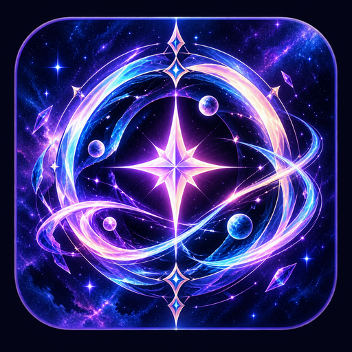<br>
  <em>Infinite Worlds. One Soul.</em>
</p>
