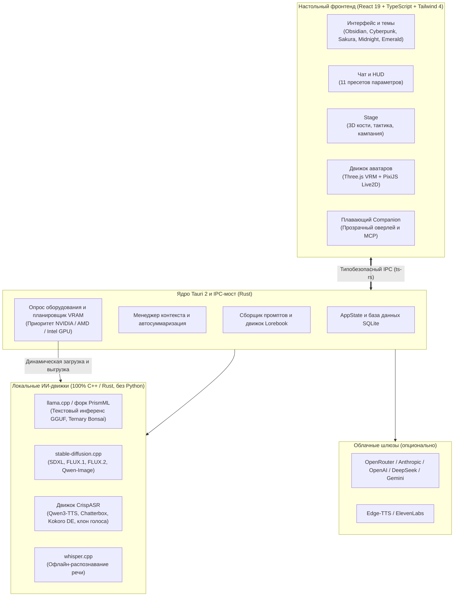
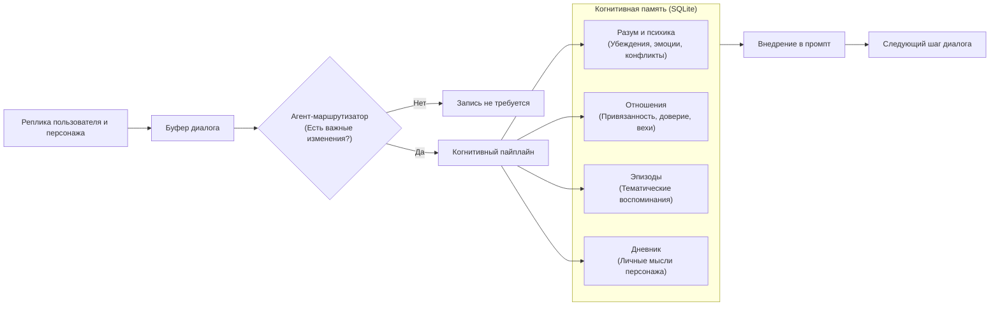

<p align="center">
  
</p>

<p align="center">
  <a href="README.md">🇬🇧 English</a> •
  <a href="README.de.md">🇩🇪 Deutsch</a> •
  <a href="README.ru.md"><strong>🇷🇺 Русский</strong></a>
</p>

<p align="center">
  <strong>Персональные ИИ-компаньоны. Живые 3D и 2D аватары. Долговечные воспоминания. Движок для настольных ролевых игр.</strong><br>
  <em>Нативная локальная десктоп-платформа для глубокого ролевого отыгрыша, захватывающих историй и умных виртуальных спутников.</em>
</p>

<p align="center">
  <a href="https://github.com/SnowwhiteOakheart/OtakuSoul"></a>
  
  
  
  
  
  
  
</p>

<p align="center">
  <a href="#-почему-otakusoul">Почему OtakuSoul?</a> •
  <a href="#-главные-возможности">Возможности</a> •
  <a href="#-обзор-функций-и-скриншоты">Скриншоты и тур</a> •
  <a href="#-архитектура-системы-и-памяти">Архитектура</a> •
  <a href="#-производительность-на-реальном-железе">Производительность</a> •
  <a href="#-установка-и-быстрый-старт">Установка</a> •
  <a href="#-технологический-стек">Технологии</a>
</p>

---

## 🌌 Почему OtakuSoul?

Обычные чат-интерфейсы часто воспринимают персонажей как разовые промпты: как только контекстное окно заполняется или закрывается вкладка, индивидуальность персонажа растворяется.

**OtakuSoul меняет этот подход.** Созданный как высокопроизводительное нативное приложение для ПК на **Rust (Tauri 2)** и **React 19**, OtakuSoul наделяет персонажей настоящей виртуальной жизнью:

* 🧠 **Души, которые помнят:** С помощью когнитивной системы **Memory** персонажи формируют полноценную четырёхуровневую память — включая глубинные убеждения, внутренние конфликты, динамику отношений и личные дневниковые записи.
* 🎭 **Выразительные аватары:** Общайтесь с вашими спутниками в виде **3D VRM** или **Live2D** моделей, реагирующих в реальном времени с поддержкой 28 эмоций, слежения взглядом, моргания и аудиосинхронизации губ (LipSync).
* 🎲 **От диалога к настольным приключениям:** Режим **Stage** превращает любой чат в полноценную настольную ролевую кампанию (TTRPG). Двухэтапный ИИ-гейммастер направляет сюжет, а 3D-броски костей, состояние здоровья группы, стресс и квесты создают неподдельный азарт.
* 🤖 **Настоящий компаньон на вашем рабочем столе:** Плавающий полупрозрачный **Companion** парит над вашими окнами, обладает собственным гормональным биоритмом, выполняет десктопные инструменты и взаимодействует с окружением через **Model Context Protocol (MCP)**.
* 🔒 **100% Local-First и полная конфиденциальность:** Запускайте современные языковые модели (GGUF через llama.cpp/PrismML), генерацию изображений (stable-diffusion.cpp) и синтез речи (CrispASR) прямо на вашей видеокарте в офлайн-режиме. **Никакого Python, никакого venv и никакой скрытой телеметрии.** При необходимости все крупные облачные провайдеры подключаются в один клик.

---

## ⚡ Главные возможности

| Модуль | Описание |
|---|---|
| 💬 **Иммерсивный чат** | Умное управление контекстным окном с автосжатием старых реплик в связный сюжет («Предыстория»), варианты ответов (свайпы `< 1/3 >`), инлайн-редактор с защитой черновиков от сбоев, вложения (изображения, PDF, текст), встроенный перевод реплик, поиск (Ctrl+F), закладки и ветвление диалога. |
| 🎭 **3D и 2D аватары** | Нативная поддержка **3D VRM 0.x/1.0**, **MMD-моделей (PMX/PMD, с VMD-движениями и физикой волос)**, **аватаров glTF/GLB (риг в стиле Mixamo, блендшейпы ARKit)** и **Live2D Cubism 2/4** с автоопределением эмоций, физикой волос и одежды, управлением взглядом и синхронизацией губ по аудиосигналу с формами рта (а/и/у/э/о). Собственные **движения VRMA или Mixamo FBX** (цикл ожидания, взмах рукой, кивок, эмоции) проигрываются при ролевых действиях вроде *машет*. Позиция и масштаб сохраняются индивидуально для каждого персонажа. |
| 🧠 **Когнитивная память** | 4 уровня памяти: Разум и психика, Динамика отношений, Эпизодические воспоминания, Личный дневник. Автономные агенты Router и Archivist осмысливают диалоги, а снапшоты защищают данные. Каждое воспоминание содержит источник, его можно редактировать, закреплять или забывать; при изменении исходного сообщения память помечается для проверки. |
| 🎲 **Stage (НРИ / TTRPG)** | Соло и групповые ролевые приключения: двухэтапный ИИ-мастер, анимированные 3D-кости, динамические NPC, редактор состояния мира. Полная многоязычность для сцен и лорбуков через otakusoul_i18n. |
| 🌍 **Динамическая локализация** | Модульная система локализации на базе JSON (otakusoul-data/locales). Новые языки можно добавлять простым размещением файлов локализации без перекомпиляции программы. |
| 🤖 **Companion (Агент рабочего стола)** | Плавающее поверх всех окон полупрозрачное окно с поддержкой сквозных кликов (click-through), нейрогормональная модель (дофамин, кортизол, окситоцин, усталость), вызов инструментов (поиск в сети, скриншоты, буфер обмена, скрипты) и 25-секундный таймер подтверждения действий пользователем (Human-in-the-Loop). |
| 🎙️ **Аудио и синтез речи (TTS)** | 100% локально без Python через CrispASR: Qwen3-TTS (10 языков), Chatterbox (23 языка), немецкий Kokoro 82M, **голос по описанию** (Qwen3-TTS VoiceDesign), TADA 3B (10 языков), Chatterbox Turbo со слышимым смехом и вздохами и **клонирование голоса** по аудиофрагменту длительностью 5–15 с. Поддержка облачных Edge-TTS и ElevenLabs, а также локальное распознавание речи Whisper. |
| 🖼️ **Локальная генерация картинок** | Офлайн-генерация через stable-diffusion.cpp (SD 1.5 для карт с 4 ГБ VRAM, SDXL, FLUX.1, Qwen-Image, FLUX.2), аниме-LoRA для поддерживаемых архитектур. Интеллектуальный VRAM-планировщик пошагово выгружает языковые модели при нехватке видеопамяти и перезапускает их после генерации. |
| 🌐 **Хаб сообщества** | Интеграция с каталогом Chub AI с автоизвлечением встроенных лорбуков, импорт и экспорт карточек SillyTavern V2 (PNG и JSON), движок Lorebook 2.0 с логическими триггерами и 5-шаговый мастер создания персонажей. |
| 📱 **Мобильный веб-клиент** | Общайтесь со смартфона или планшета в одной Wi-Fi сети: встроенный сервер Axum с генерацией векторного QR-кода, токен-авторизацией и защитой от DNS-rebinding. |
| 🎨 **Дизайн и доступность** | 5 цветовых тем (Obsidian, Cyberpunk, Sakura, Midnight, Emerald), полная поддержка языков (EN, DE, RU), стандарты доступности (WCAG AA), командная строка быстрых действий (`Ctrl+K`) и быстрые виртуализированные списки. |

---

## 📸 Обзор функций и скриншоты

### 1. Живые диалоги и 3D/2D аватары
Ведите диалог в атмосферном интерфейсе чата. 3D VRM или Live2D модель персонажа динамически реагирует на каждую реплику, а настраиваемый ролевой HUD отображает ключевые параметры: привязанность, энергию и настроение.

<p align="center">
  
</p>

* **Синхронизация губ со звуком (LipSync):** Движок речи управляет анимацией рта персонажа строго синхронно с произносимыми фразами.
* **Никакой потери контекста:** При заполнении контекстного окна фоновый процесс бережно сжимает ранние события в краткую «Предысторию сюжета», доступную для чтения и редактирования.
* **Компактный режим:** Переключатель интерфейса позволяет уменьшить отступы сообщений, а показатели HUD можно свернуть в один клик.
* **Центр фоновых задач:** Загрузки моделей, рефлексия памяти, генерация картинок и статус инференса отображаются в единой панели задач в шапке с возможностью отмены или повтора.
* **Эффекты голоса:** Робот, рация, призрак, пещера, низкий голос или фея – либо свои значения высоты, реверберации, эха и фильтров, для любого движка речи.
* **Оформление каждого чата:** Свой фон, размер текста, стиль пузырей и фоновый звук с громкостью – сохраняются для каждого чата, картинки и звуки общие с библиотекой Stage.
* **Инструменты в чате:** По желанию модель использует дату/время, калькулятор и веб-поиск – с любым провайдером и локальными моделями; использование видно в блоке рассуждений.
* **Устойчивость к сбоям:** Свайпы вариантов ответов, инлайн-редактирование и сохранение черновиков гарантируют сохранность текста даже при внезапных обрывах связи.

---

### 2. Stage — Интерактивная сцена настольных ролевых игр
Окунитесь в настольные приключения с ИИ-мастером. Режим Stage объединяет свободу повествования с классическими правилами настольных ролевых игр (TTRPG).

<p align="center">
  
</p>

* **Двухэтапный ИИ-гейммастер:** Модель-планировщик проектирует ход сюжета и вызовы; исполняющая модель оживляет окружение и действия спутников.
* **3D-броски костей:** Проверки навыков с учётом сложности (DC), броски кубиков в реальном 3D и визуальные спецэффекты для критических успехов и провалов.
* **Сюжетные кампании:** Проходите готовые модули (например, 12 глав по вселенной *No Game No Life*) или создавайте собственные миры.
* **NPC с памятью:** Встречайте торговцев, стражников или злодеев, обладающих личной памятью — и приглашайте их в постоянную группу искателей приключений!
* **Бои, совместимые с 5e (SRD 5.1):** По желанию движок правил решает каждый бросок, попадание и ход противника, а ведущий лишь рассказывает — с классами, монстрами SRD и тактическим полем боя (перемещение, линия обзора, дистанции, провоцированные атаки).

<p align="center">
  
</p>

* **Полный контроль над миром:** Встроенный редактор позволяет тонко настраивать факты, сюжетные арки, тайны, отношения между героями и инвентарь.

---

### 3. Cognitive Memory — Глубина личности персонажа
Персонажи в OtakuSoul помнят вас. После каждого диалога когнитивный пайплайн анализирует события и обновляет слои долгосрочной памяти.

<p align="center">
  
</p>

* **Разум и психика:** Базовые убеждения, сиюминутные эмоциональные состояния, скрытые мотивы и когнитивные диссонансы формируют живое поведение.
* **Развитие отношений:** Доверие, эмоциональная близость и пройденные вместе испытания развиваются естественно и правдоподобно.
* **Дневник и эпизоды:** Персонаж ведёт личный дневник от первого лица, рефлексируя над совместными событиями.
* **Прозрачность Markdown:** Все слои памяти можно открыть во встроенном редакторе как `MEMORY.md` и `USER.md` для ручной правки и синхронизации.

---

### 4. Companion — ИИ-агент на рабочем столе
Выведите персонажа прямо на рабочий стол. В формате плавающего окна без рамок ваш виртуальный спутник будет рядом на протяжении всего дня.

<p align="center">
  
</p>

* **Прозрачный оверлей и сквозные клики:** Расположите персонажа в углу экрана так, чтобы он не мешал работе и играм.
* **Биометрический гормональный профиль:** Дофамин, кортизол, окситоцин и уровень усталости формируют настроение, концентрацию и поведение компаньона.
* **Инструменты ПК:** По вашей просьбе компаньон может искать информацию в интернете, анализировать скриншоты экрана, управлять плеером по MPRIS или запускать скрипты.
* **Безопасность Human-in-the-Loop:** 25-секундный таймер с подтверждением требует вашего согласия перед любым важным действием, а встроенный фильтр приватности скрывает пароли и платёжные окна.

---

### 5. Студия персонажей, лорбуки и Хаб сообщества
Создавайте уникальных героев с нуля или загружайте карточки из огромной библиотеки сообщества.

<p align="center">
  
</p>

<p align="center">
  
</p>

* **Совместимость с SillyTavern V2:** Импорт и экспорт карточек в форматах PNG (со встроенными метаданными) и JSON.
* **5-шаговый мастер ИИ-генерации:** Превратите абстрактную идею в детально проработанного персонажа с историей, характером и первым сообщением.
* **Каталог Chub AI:** Ищите тысячи карточек прямо в приложении и автоматически извлекайте встроенные книги знаний (лорбуки).
* **Движок Lorebook 2.0:** Интерактивные энциклопедии знаний с гибкими триггерами (И, ИЛИ, НЕ, регулярные выражения), накоплением напряжения и цепочками активации.

---

## 🏛️ Архитектура системы и памяти

### 1. Обзор технической структуры

OtakuSoul строго разделяет пользовательский интерфейс, управление инференсом и аппаратные ресурсы. Благодаря нативным движкам C++/Rust **среда Python не требуется**:



---

### 2. Когнитивный пайплайн памяти

Каждый диалоговый блок проходит многоуровневую рефлексию для органичного развития персонажей:



---

## 📊 Производительность на реальном железе

Тестирование OtakuSoul проводилось на эталонной конфигурации (**NVIDIA GeForce RTX 4070 Ti SUPER, 16 ГБ VRAM**, Linux CUDA):

### Локальная генерация изображений (stable-diffusion.cpp)
Модели картинок и LoRA настраиваются в **Настройки → Картинки**, голос и распознавание речи — в **Настройки → Голос**.

Благодаря планировщику видеопамяти генерация картинок делит ресурсы с языковой моделью без конфликтов:

| Модель | Время генерации | Расход VRAM | Поведение VRAM |
|---|---|---|---|
| **Counterfeit V3.0** (SD 1.5) | ~15 с | ~2 ГБ весов | Подходит для видеокарт с 4 ГБ VRAM; излишки сбрасываются в RAM |
| **Animagine XL 4.0** (SDXL) | ~28 с | ~7,6 ГБ | Работает параллельно с уменьшенной языковой моделью (44 слоя на GPU) |
| **FLUX.1 dev** (Q5_K_S) | ~48 с | ~9,0 ГБ | Работает параллельно с языковой моделью (26 слоёв на GPU) |
| **Qwen-Image 2.1** (Q4_K) | ~73 с | ~5,6 ГБ | Доступна параллельная работа с выгрузкой части слоёв на CPU |
| **FLUX.2 dev** (Q4_K_S) | ~248 с | ~14,4 ГБ | Пошаговая ротация: временно выгружает чат-модель и возвращает её после завершения |

**LoRA:** Проверенный каталог (Anime Detailer, Style Enhancer, Pastel Anime для SDXL, GHIBSKY для FLUX.1) скачивается с Hugging Face с проверкой по SHA-256. Пользовательские файлы из папки `loras` подхватываются автоматически.

### Синтез речи и клонирование голоса (CrispASR)
Скорость синтеза и разборчивость речи (по результатам распознавания Whisper):

| Модель | Голос / Режим | Немецкий | Русский | Английский | RTF (Real-Time Factor) | Прирост VRAM |
|---|---|---|---|---|---|---|
| **Qwen3-TTS 0.6B** (CustomVoice) | Vivian / Ryan | 100% | 90% | 100% | 0,12 – 0,13 (очень быстро) | +2,3 – 3,2 ГБ |
| **Qwen3-TTS 1.7B Base** | **Клон голоса** (16–24 кГц) | 100% | 100% | 100% | 0,15 (в реальном времени) | +3,3 – 3,6 ГБ |
| **Chatterbox Multilingual** | Стандартный голос | 92% | 70% | – | 0,30 – 0,55 | +1,8 – 2,3 ГБ |
| **Kokoro DE** | Victoria / Bernd / Eva | 77% | – | – | 0,06 – 0,23 (сверхбыстро) | +1,0 – 1,8 ГБ |

> [!NOTE]
> Локальный чат возобновляет работу уже через 1–4 секунды после завершения генерации картинки или озвучки!

---

## 📥 Установка и быстрый старт

OtakuSoul предоставляет нативные установщики для популярных операционных систем:

### 🐧 Linux (Debian, Ubuntu, Arch, Fedora и др.)
* **Установка в один клик (рекомендуется):**
  ```bash
  chmod +x install.sh && ./install.sh
  ```
  Устанавливает программу в `~/.local/bin/otakusoul`, настраивает ярлык высокого разрешения и пункт в меню приложений (GNOME, KDE, XFCE).
* **Debian / Ubuntu:**
  ```bash
  sudo dpkg -i OtakuSoul_0.3.0_amd64.deb
  ```
* **Arch Linux (AUR):**
  ```bash
  cd packaging/aur && makepkg -si
  ```
* **Портативный AppImage:**
  ```bash
  chmod +x OtakuSoul_0.3.0_amd64.AppImage && ./OtakuSoul_0.3.0_amd64.AppImage
  ```

### 🪟 Windows (10 / 11)
* **Быстрая установка через PowerShell:**
  ```powershell
  powershell -ExecutionPolicy Bypass -File .\install.ps1
  ```
  Устанавливает OtakuSoul в `%LOCALAPPDATA%\Programs\OtakuSoul\`, создаёт ярлыки в меню «Пуск» и на рабочем столе.
* **Графический инсталлятор NSIS:** Запустите `OtakuSoul_0.3.0_x64-setup.exe`.

### 🍏 macOS (Apple Silicon и Intel)
* **Установка через Терминал:**
  ```bash
  chmod +x install-macos.sh && ./install-macos.sh
  ```
  Копирует приложение в `/Applications`, снимает карантинные флаги Gatekeeper и интегрирует программу с Spotlight и Launchpad.
* **Образ DMG:** Откройте `OtakuSoul_0.3.0_universal.dmg` и перетащите OtakuSoul в папку «Программы».

---

## 🛠️ Для разработчиков

### Требования
* **Node.js** 20+ и `npm`
* **Rust** 1.78+ (`cargo`)
* *Linux:* WebKitGTK 4.1, GTK 3, libsoup 3, librsvg 2

### Запуск окружения разработки
```bash
# Установка зависимостей
npm install

# Запуск сервера разработки с горячей перезагрузкой
npm run tauri dev

# Для Linux (с оптимизациями X11/WebKit)
npm run tauri:linux
```

### Тестирование и проверка типов
```bash
# Полный локальный набор проверок (oxlint, tsc, vitest, cargo fmt, clippy, cargo test)
npm run check

# Перегенерация типов TypeScript из структур Rust (ts-rs)
npm run types:gen

# End-to-End тестирование (сборка в target/e2e и тест против Mock-LLM)
npm run e2e

# Замер производительности длинных диалогов (1000 сообщений)
npm run e2e:perf
```

---

## 🧰 Технологический стек

* **Десктоп-архитектура:** [Tauri 2](https://tauri.app/) (безопасность, малый вес, минимальное потребление RAM)
* **Бэкенд:** [Rust](https://www.rust-lang.org/) на базе [Tokio](https://tokio.rs/), [SQLite](https://sqlite.org/) через `rusqlite`, `reqwest` и `axum`
* **Фронтенд:** [React 19](https://react.dev/), [TypeScript](https://www.typescriptlang.org/), [Vite](https://vitejs.dev/) и [Tailwind CSS 4](https://tailwindcss.com/)
* **Управление состоянием:** [Zustand](https://github.com/pmndrs/zustand) с модульной структурой слайсов
* **Отрисовка аватаров:** [Three.js](https://threejs.org/) и [@pixiv/three-vrm](https://github.com/pixiv/three-vrm) для 3D; [PixiJS](https://pixijs.com/) и Live2D Cubism Core для 2D
* **Локальные ИИ-движки:** llama.cpp и PrismML (GGUF), stable-diffusion.cpp, CrispASR, whisper.cpp
* **Аудио и голос:** Web Audio API с анализом спектра FFT в реальном времени, CrispASR, Edge-TTS, ElevenLabs

---

## ⚖️ Лицензия и этика

OtakuSoul распространяется на условиях лицензии **GNU General Public License v3.0 (GPLv3)**.

### Благодарности (Credits)
OtakuSoul создавался как самостоятельный порт и переработка Python-проекта [Soul of Waifu](https://github.com/jofizcd/Soul-of-Waifu) от [jofizcd](https://github.com/jofizcd) на стеке Rust/Tauri (GPLv3).

### Правила 5e (SRD 5.1)
Необязательные правила Soul Stage, совместимые с 5e (монстры, шаблоны классов, правила боя в `presets/srd5/` и движок правил), основаны на SRD 5.1:

> This work includes material taken from the System Reference Document 5.1 ("SRD 5.1") by Wizards of the Coast LLC and available at https://dnd.wizards.com/resources/systems-reference-document. The SRD 5.1 is licensed under the Creative Commons Attribution 4.0 International License available at https://creativecommons.org/licenses/by/4.0/legalcode.

### ИИ-модели и прозрачность
OtakuSoul принципиально **не содержит** проприетарных весов моделей в дистрибутивах:
* Все среды исполнения и модели загружаются исключительно из официальных источников (например, Hugging Face) и валидируются по **контрольной сумме SHA-256**.
* Некоммерческие модели (например, FLUX.1 dev) по умолчанию заблокированы и требуют явного согласия пользователя в настройках.
* **Ответственное клонирование голоса:** Для клонирования требуется подтверждение согласия владельца голоса. Сгенерированные аудиофайлы помечаются цифровыми водяными знаками в CrispASR в соответствии с нормами европейского законодательства об ИИ (**EU AI Act, Art. 50**).

---

<p align="center">
  <br>
  <em>Infinite Worlds. One Soul.</em>
</p>
