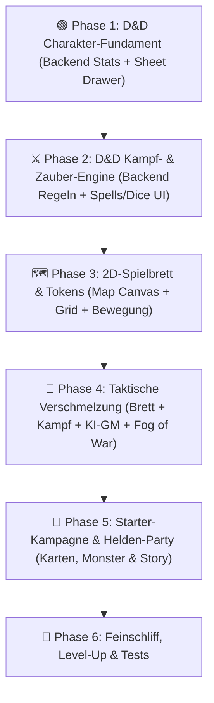

# 🐉 OtakuSoul – Roadmap: D&D 5e Erweiterung, Tactical Battle Map & Szenario (Soul Stage)

> **Status:** Abgestimmt & Genehmigt (Vertikale Meilenstein-Struktur)  
> **Regelwerk:** D&D 5e SRD (System Reference Document 5.1)  
> **Architektur:** Vertikale Slices – jede Phase liefert direkt sichtbare und testbare Ergebnisse (Backend + Frontend).  
> **Dateiname:** `Roadmap_DND.md`

---

## 🎯 Vision & Design-Entscheidungen

### 1. D&D 5e SRD als mathematisches Fundament
* **Attribute & Modifikatoren:** Die 6 Kernattribute (STR, DEX, CON, INT, WIS, CHA) mit Berechnung $\lfloor(Wert - 10) / 2\rfloor$.
* **Verteidigung & Bewegung:** Rüstungsklasse (AC / Armor Class), Initiative (`1d20 + DEX-Mod`), Bewegungsrate (z. B. 30 ft = 6 Felder).
* **Übung & Klassenwerte:** Übungsbonus (Proficiency Bonus, +2 auf Level 1–4), Rettungswürfe, Fertigkeiten, Trefferwürfel (Hit Dice) für kurze Rasten.
* **Zauber & Zauberplätze:** Zauberplätze Stufe 1–9, Zauber-Rettungswurf-DC ($8 + \text{Prof} + \text{Casting-Mod}$) und Zauberangriffswurf ($\text{Prof} + \text{Casting-Mod}$).
* **Todesrettungswürfe (Death Saves):** Bei 0 LP wird gewürfelt (3 Erfolge = stabil, 3 Fehlschläge = tot, Nat 20 = 1 LP).

### 2. Taktisches 2D-Spielbrett (Tactical Battle Map)
* **5-Fuß-Raster (Grid):** Skalierbares Gitter über dem Szenen-Hintergrundbild (Dungeon, Taverne, Wald).
* **Runde Tokens:** Interaktive Spielsteine für Helden und Monster (Porträts mit kreisförmigem LP-Balken, Initiativ-Rang und Status-Badges).
* **Bewegungs-Reichweite:** Klick auf ein Token blendet die Bewegungsreichweite grün ein (z. B. 6 Felder bei 30 ft). Klick/Drag bewegt die Figur.
* **Reichweiten-Prüfung:** Nahkampf (1 Nachbarfeld = 5 ft), Fernkampf/Zauber (Reichweiten-Radien 30/60/120 ft) sowie AOE-Flächenschablonen.
* **Nebel des Krieges (Fog of War):** Dunkle Dungeon-Kacheln werden aufgedeckt, wenn die Helden vorrücken.

### 3. Freie Charakterwahl (Klassisch vs. Waifus)
* **4 klassische D&D-Archetypen mitgeliefert:** Thorin (Zwerg / Kämpfer), Lyra (Elfe / Magierin), Finn (Halbling / Schurke), Althea (Mensch / Klerikerin).
* **Volle Flexibilität:** Spieler wählen frei zwischen der klassischen Party, eigenen OtakuSoul-Gefährten/Waifus (mit D&D-Klassen) oder gemischten Gruppen.
* **Separates Content-Repository:** Standardisiertes Format (`campaign.json`), um künftig Kampagnen, Karten und Helden-Packs modular herunterzuladen.

---

## 🏗️ Phasen-Architektur (Vertikale Slices)

---

## 📋 Umsetzungsphasen

### 🟢 Phase 1: D&D Charakter-Fundament (Werte & Bogen)

Ziel: D&D 5e-Charakterwerte im Backend und sofort sichtbare Visualisierung im aufklappbaren Charakterbogen.

- [ ] **`ruleset`-Flag in `SceneDefinition`:**
  - `"standard"` vs. `"dnd5e"` (in [`models.rs`](file:///home/deathtrap/development/OtakuSoul/src-tauri/src/modules/stage/models.rs)).
- [ ] **`DndStats` Datenstruktur in Rust:**
  - **Attribute:** `strength`, `dexterity`, `constitution`, `intelligence`, `wisdom`, `charisma` (Scores 1–30).
  - **Berechnete Modifikatoren:** `(score - 10) / 2` (abgerundet).
  - **Verteidigung & Tempo:** `armor_class: u32`, `speed_ft: u32` (z. B. 30), `speed_squares: u32` (z. B. 6).
  - **Level & Übung:** `level: u32`, `class_name: String`, `proficiency_bonus: i32` (+2 auf Level 1–4).
  - **Proficiencies:** `saving_throws: Vec<String>`, `skills: Vec<String>`.
  - **Trefferwürfel (Hit Dice):** `hit_dice_total: u32`, `hit_dice_remaining: u32`, `hit_die_type: u32` (z. B. 8 für d8).
  - **Zauberplätze:** `spell_slots: HashMap<u32, SpellSlotState>` (`max`, `used` für Zirkel 1–9).
  - **Todesrettungswürfe:** `death_saves: DeathSaveState` (`successes: 0..3`, `failures: 0..3`).
  - **Passive Wahrnehmung:** $10 + \text{WIS-Mod} + \text{Übung (falls geübt)}$.
- [ ] **Einbindung in `Combatant`:**
  - `pub dnd_stats: Option<DndStats>` in `Combatant` für Spieler, Gefährten und Monster.
- [ ] **TypeScript-Typen:**
  - `npm run types:gen` ausführen, `src/types/index.ts` und `src/types/wireCheck.ts` abgleichen.
- [ ] **Frontend: D&D Character Sheet Drawer (`DndCharacterSheet.tsx`):**
  - Kacheln für die 6 Kernattribute mit großen Modifikatoren (+3, +2, -1) und Grundwerten.
  - Schild-Badge mit Rüstungsklasse (AC), Initiative-Badge, Gehweite und passiver Wahrnehmung.
  - Fertigkeiten-Liste mit Geübt-Markern (`●`/`○`).
  - Trefferwürfel-Zähler und Todesrettungswurf-Status (3 grüne / 3 rote Punkte).
  - Öffnen per Klick auf Charakter-Avatar im Party-Header.

---

### ⚔️ Phase 2: D&D Kampf- & Zauber-Engine (Regeln, Würfel & Spells)

Ziel: Ein vollwertiger, mathematisch verbindlicher D&D 5e-Kampf mit Rüstungsklasse, Rettungswürfen und Zaubern.

- [ ] **Vorteil & Nachteil (Advantage / Disadvantage):**
  - Parsing im Würfelmodul [`dice.rs`](file:///home/deathtrap/development/OtakuSoul/src-tauri/src/modules/stage/dice.rs):
    - Vorteil: 2d20 rollen, den höheren werten (`discarded_roll` merken).
    - Nachteil: 2d20 rollen, den niedrigeren werten.
  - UI-Schalter im [`DiceRoller.tsx`](file:///home/deathtrap/development/OtakuSoul/src/components/stage/DiceRoller.tsx): **Normal | Vorteil | Nachteil**.
- [ ] **Angriffswurf vs. Rüstungsklasse (Attack Roll):**
  - Formel: `1d20 + Angriffsbonus` gegen `Target AC`.
  - Treffer $\rightarrow$ automatischer Schadenswurf (`Schadensformel + Attributsmodifikator`).
  - Nat 20 = Kritischer Treffer (doppelte Schadenswürfel); Nat 1 = Automatischer Fehlschlag.
- [ ] **Zauber & Rettungswürfe:**
  - `DndSpell` Datenmodell: Name, Zirkel (0–9), Reichweite, Zauberdauer, Rettungswurf-Stat, Schadens-/Heilformel.
  - Ziel wirft `d20 + Save-Mod` gegen Zauber-DC ($8 + \text{Prof} + \text{Mod}$).
  - Automatischer Schaden bei Misserfolg (oder halber Schaden bei Erfolg).
- [ ] **Frontend: Zauberbuch-Modal (`SpellbookModal.tsx`):**
  - Übersicht aller Zauber der Figur, sortiert nach Zirkeln (Zaubertricks, Grad 1, Grad 2).
  - Button *„Diesen Zauber wirken“* führt den Wurf aus und zieht automatisch den passenden Spell Slot ab.
- [ ] **5e-Zustände & 0 LP:**
  - *Liegend (Prone), Vergiftet (Poisoned), Gelähmt (Paralyzed)* mechanisch in Proben berücksichtigen.
  - Bei 0 LP fällt Charakter ins Koma; Wurf auf Death Saves zu Zugbeginn.
- [ ] **D&D Rast-Mechanik:**
  - **Kurze Rast:** Ausgeben von Trefferwürfeln (`1d8 + CON`) zur LP-Heilung.
  - **Lange Rast:** Volle LP, alle Spell Slots zurück, Hälfte der Trefferwürfel regeneriert.

---

### 🗺️ Phase 3: Das 2D-Spielbrett (Map Canvas, Tokens & Bewegung)

Ziel: Ein visuell ansprechendes, isoliertes und performantes Spielbrett-Canvas mit Kachelraster und Tokens.

- [ ] **Backend-Zustand für die Karte (`StageMapState`):**
  - `grid_columns: u32` (z. B. 16), `grid_rows: u32` (z. B. 12).
  - `map_background: String` (Top-Down-Hintergrundbild).
  - `wall_mask: Vec<bool>` (Hindernisfelder / Wände).
  - `token_x: Option<i32>`, `token_y: Option<i32>` in `Combatant`.
- [ ] **Frontend: 2D-Battle-Map Komponente (`StageBattleMap.tsx`):**
  - Skalierbares 5-Fuß-Raster (Canvas / SVG / CSS-Grid) über dem Hintergrund.
  - Runde Tokens mit Charakter-Porträts, LP-Kreis und Initiativ-Rang.
  - Klick auf Token hebt erlaubte Bewegungsfelder grün hervor (z. B. 6 Felder bei 30 ft).
  - Flüssige Drag-and-Drop- oder Klick-Bewegung mit Kollisionsprüfung gegen Wände.
- [ ] **Ansichts-Umschaltung in Soul Stage:**
  - Neuer Reiter / Ansichtsmodus **🗺️ Spielbrett** neben 📜 *Abenteuer* und 🎒 *Kampagne*.

---

### 🎯 Phase 4: Taktische Verschmelzung (Spielbrett + Kampf + KI-GM)

Ziel: Spielbrett und D&D-Kampfmechanik greifen nahtlos ineinander; die KI leitet und platziert Gegner räumlich.

- [ ] **Taktische Reichweiten-Prüfung auf dem Gitter:**
  - Distanzberechnung auf dem Brett (1 Kachel = 5 ft).
  - Nahkampfangriffe nur bei Nachbarfeldern (Distanz $\le 1$).
  - Fernkampf & Zauber prüfen Schusslinie und Distanzkreis (z. B. 12 Felder = 60 ft).
  - AOE-Schablonen (Kreis- und Kegel-Overlay für Flächenzauber).
- [ ] **KI-GM Planer-Erweiterung:**
  - GM spawnt Monster direkt mit Koordinaten `[x, y]` auf dem Spielbrett (`spawn_npcs` / `encounter`).
  - GM plant Bewegungszüge für Monster (rückt auf Helden vor oder hält Distanz).
- [ ] **Nebel des Krieges (Fog of War):**
  - Kacheln sind abgedunkelt; Vorrücken der Helden deckt Räume und Korridore schrittweise auf.
- [ ] **Aktive Kampf-HUD Integration:**
  - Schnellaktionen direkt vom Brett aus: Token anklicken $\rightarrow$ *Angriff* auf gegnerisches Token oder *Zauber wirken*.

---

### 🏰 Phase 5: Starter-Kampagne & Helden-Party

Ziel: Ein vollständiges, atemberaubendes Starter-Abenteuer mit Karten, Monstern und Helden.

- [ ] **Klassische D&D-Heldenkarten (4 Archetypen mit Tokens, Stats & Spells):**
  1. **Thorin Eisenfaust (Zwerg / Kämpfer):** AC 18, Langschwert (`1d8+3`), Second Wind.
  2. **Lyra Sternenweberin (Hochelfe / Magierin):** AC 12, Feuerpfeil, Magisches Geschoss, Schild, Schlaf.
  3. **Finn Flinkfinger (Halbling / Schurke):** AC 14, Dolche (`1d4+3`), Sneak Attack (+1d6), Diebeswerkzeug.
  4. **Althea Sonnenglanz (Mensch / Klerikerin):** AC 16, Streitkolben (`1d6+2`), Heilendes Wort, Segnen.
- [ ] **Lobby-Wahlfreiheit:**
  - Umschalter in der Szenen-Lobby: *Klassische D&D-Helden* vs. *Eigene Gefährten / Waifus*.
- [ ] **Starter-Kampagne „Die Gruft der Vergessenen Schatten“:**
  - **Akt 1: Der Goblin-Hinterhalt:** Top-Down-Karte 1 (Waldstraße & umgestürzter Wagen, Goblins im Dickicht).
  - **Akt 2: Die vergessenen Katakomben:** Top-Down-Karte 2 (Verlies, Fallen-Korridor, Skelett-Gruft).
  - **Akt 3: Der Schattenaltar:** Top-Down-Karte 3 (Große Altar-Halle, Nekromant und Zombie-Diener).
- [ ] **D&D 5e SRD Lorebook:**
  - Gebundenes Lorebook mit Zaubersprüchen, Zustandsdefinitionen und Monster-Statblöcken.
- [ ] **Vorbereitung externes Content-Repository:**
  - Saubere Ordner- & Manifest-Struktur (`campaign.json`), um künftige Kampagnen, Karten und Helden-Packs modular herunterzuladen.

---

### 💎 Phase 6: Feinschliff, Level-Up & Dokumentation

- [ ] **Meilenstein-Stufenaufstieg (Level-Up):**
  - Belohnung nach Abschluss der Gruft: Aufstieg von Stufe 1 auf Stufe 2 (mehr LP, neue Spell Slots, Klassen-Features).
- [ ] **E2E-Tests:**
  - E2E-Test für D&D-Charakterbogen, Battle-Map-Rendering, Token-Bewegung und Angriffswurf vs. AC.
- [ ] **Dokumentation:**
  - `AI.md` und `README.md` um die D&D 5e Engine, Spielbrett-Steuerung und `ruleset: "dnd5e"` aktualisieren.
