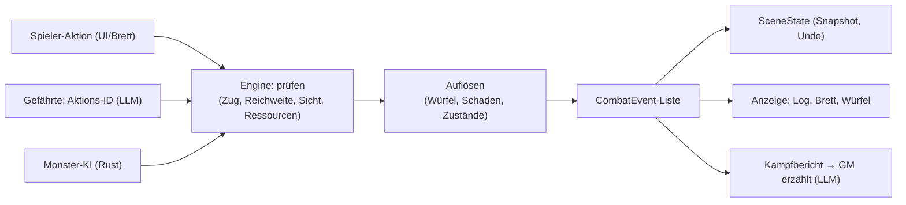

# 🐉 OtakuSoul – Roadmap: 5e-Regeln, Spielbrett & Starter-Abenteuer (Soul Stage)

> **Status:** Arbeitsentwurf, gemeinsam fortgeschrieben (Stand 06.10.2026). Offene Punkte dieser Erweiterung stehen
> hier; `roadmap.md` verweist auf diese Datei. Erledigtes wird abgehakt und bei Abschluss eines Schritts nach
> `roadmap_abgeschlossen.md` übertragen.
> **Regelgrundlage:** System Reference Document 5.1 (SRD 5.1, CC-BY-4.0) – „5e-kompatibel“, nicht „D&D“ (Marke von
> Wizards of the Coast). Namensnennung siehe [Lizenz & Namensnennung](#lizenz--namensnennung).

---

## 1. Festgelegte Entscheidungen

| # | Entscheidung | Folge |
|---|---|---|
| E1 | **Die Regel-Engine ist maßgeblich.** Würfe, Treffer, Schaden, Bewegung, Reichweite und Monsterzüge berechnet Rust deterministisch. | Das LLM erzählt und äußert höchstens *Absichten*; Zahlen aus dem LLM werden im 5e-Modus ignoriert. |
| E2 | **Monster steuert ausschließlich die Engine** (eigene Monster-KI). | Kein LLM-Aufruf pro Monsterzug, reproduzierbar und testbar. |
| E3 | **Karten sind Raster als JSON, gezeichnet mit eigenen Kachel-SVGs.** | Wände, Türen, Gelände und Startzonen sind exakt bekannt; keine Fremd-Assets. Was gezeichnet werden muss, steht in [`todo_assets.md`](todo_assets.md). |
| E4 | **Regelwerk pro Szene:** `ruleset: "standard" \| "5e"`. | Bestehende Erzähl-Szenen (Stress, freie Proben) bleiben unverändert. |
| E5 | **Daten statt Code:** Monster, Zauber, Klassen-Vorlagen als SRD-Daten (JSON, gebündelt). | Ausbau ohne Rust-Änderungen; Übersetzungen der Namen in den Daten (de/en/ru). |
| E6 | **Jeder Schritt ist spielbar und getestet** (Rust-Unit-Tests mit festem Zufalls-Seed, E2E mit Mock-LLM, i18n in allen Locales, AI.md/README). | Keine „Test-Phase“ am Ende. |

### Rollen im Kampf

| Wer | Entscheidet | Wie |
|---|---|---|
| Spieler | eigene Aktionen | Aktionsleiste und Spielbrett; die Engine bietet nur erlaubte Aktionen an. |
| Gefährten (LLM-Figuren) | eigene Aktionen | Die Engine erzeugt eine Liste erlaubter Aktionen; das LLM wählt **eine ID** (+ kurzer Satz). Ungültig/Timeout → Engine-Heuristik. Schalter „Gefährten selbst steuern“ (F2). |
| Monster | – | Engine-KI (Ziel wählen, bewegen, angreifen, fliehen). |
| KI-Spielleiter | Szene, Begegnungen, Erzählung | Wählt Begegnung (Monster-IDs aus der Liste) und Startzone; erzählt aus dem **Kampfbericht** der Engine. |

---

## 2. Architektur



* **Neues Modul `src-tauri/src/modules/stage/rules5e/`** – reine Funktionen ohne Datei-/Netzzugriff:
  `stats.rs` (Werte, abgeleitete Größen), `dice.rs`-Erweiterung (Vorteil/Nachteil), `combat.rs` (Initiative, Zug,
  Angriff, Schaden), `map.rs` (Raster, Wegfindung, Sichtlinie, Reichweite), `ai.rs` (Monster), `spells.rs`,
  `conditions.rs`, `data.rs` (SRD-Daten laden). Zufall wird injiziert (`impl Rng`), Tests nutzen `StdRng::seed_from_u64`.
* **Ergebnis jeder Aktion ist eine Liste `CombatEvent`** (Wurf, Treffer/Fehlschlag, Schaden, Bewegung, Zustand, Tod …).
  Sie speist Log, Brett-Animation und den Kampfbericht fürs LLM – eine Quelle der Wahrheit.
* **Zustand** liegt in `SceneState` (`combat`, neu `map`); damit gelten Snapshots/Undo (`undoStageTurn`), die
  `stage_turn`-Sperre und der Stage-Abbruch automatisch. Abbruch während einer Erzählung lässt die bereits
  aufgelösten Ereignisse bestehen.
* **GM-Plan im 5e-Modus:** `encounter.enemies` enthält Monster-**IDs** und eine Startzone statt LP; `hp_updates`,
  `resource_delta` und `dice_check`-Zahlen werden ignoriert (Proben laufen über 5e-Fertigkeiten, s. Schritt 3).
  Das Mock-LLM erkennt den Kampfbericht an „[STAGE — COMBAT REPORT]“ und die Gefährtenwahl an „[STAGE — COMBAT ACTION]“.

### Datenmodell (Skizze)

```rust
// Gespeichert werden nur Grundwerte; Modifikatoren, Übungsbonus, Felder-Tempo usw. sind Funktionen.
pub struct Stats5e {
    pub level: u32,
    pub class_id: String,             // "fighter" | "wizard" | "rogue" | "cleric" | Monster: ""
    pub abilities: [u8; 6],           // STR DEX CON INT WIS CHA
    pub armor_class: i32,
    pub speed_ft: u32,                // 30 → 6 Felder
    pub save_proficiencies: Vec<Ability>,
    pub skill_proficiencies: Vec<Skill>,
    pub attacks: Vec<Attack>,         // Name, Bonus-Quelle, Reichweite (Nah/Fern normal/lang), Schaden, Typ
    pub hit_dice: HitDice,            // Typ (d8), verbleibend
    pub spell_slots: [SlotState; 9],  // ab Schritt 3
    pub death_saves: DeathSaves,      // ab Schritt 3
}
// Combatant: + stats5e: Option<Stats5e>, position: Option<GridPos>
// SceneState: + map: Option<StageMap>
```

### Kartenformat (Skizze)

```json
{
  "id": "crypt_entrance",
  "name": { "de": "Eingang der Gruft", "en": "Crypt entrance", "ru": "Вход в склеп" },
  "tileset": "dungeon",
  "rows": ["##########", "#..D....s#", "#..#..~~.#", "#p.#.....#", "##########"],
  "legend": { "#": "wall", ".": "floor", "D": "door", "~": "difficult", "p": "start_party", "s": "spawn" },
  "zones": { "spawn": { "description": "Hinter dem Altar" } },
  "rooms": [{ "id": "hall", "description": "Kalte, feuchte Halle …" }]
}
```

Kachel-SVGs (Boden, Wand, Tür offen/zu, schwieriges Gelände, Wasser, Säule, Treppe, Truhe …) liegen gebündelt wie die
NPC-Archetypen unter `public/` und werden selbst gezeichnet.

---

## 3. Schritte

Jeder Schritt endet mit einem **„Fertig, wenn …“**, das per E2E geprüft wird.

### ✅ Schritt 0 – Aufräumen

- [x] Patch-Reste `stage/models.rs|scenes.rs .orig/.rej` entfernt, `*.orig`/`*.rej` ignoriert.
- [x] `dice.rs`: Fehlertexte als i18n-Codes; Dokukommentar korrigiert.

### ⚔️ Schritt 1 – Regelkern: ein Kampf ohne Brett

Ziel: Eine 5e-Szene, in der der GM eine Begegnung auslöst und der Kampf vollständig von der Engine entschieden wird.

- [ ] `ruleset` in `SceneDefinition` (+ Szenen-Editor, Lobby-Anzeige); `standard` bleibt Vorgabe.
- [ ] `Stats5e` mit abgeleiteten Werten (Modifikator ⌊(Wert−10)/2⌋, Übungsbonus nach Stufe, passive Wahrnehmung).
- [ ] Würfel: Vorteil/Nachteil (2W20, höherer/niedrigerer), injizierbarer Zufall; Anzeige im `DiceRoller`.
- [ ] SRD-Daten v1: ~10 Monster (Goblin, Kobold, Wolf, Skelett, Zombie, Bandit, Riesenratte, Ork, Ghul, Schatten),
  Klassen-Vorlagen Stufe 1 für Kämpfer, Magier, Schurke, Kleriker (ohne Zauber, nur Waffen/Zaubertrick-Angriff).
- [ ] Kampfablauf: Initiative (W20+GES), Reihenfolge, Zug mit Aktion/Bonusaktion/Bewegung (Bewegung abstrakt), Angriff
  gegen RK, Schaden + Modifikator, Krit (doppelte Würfel) und Patzer, 0 LP: Monster sterben, Helden sind bewusstlos.
- [ ] Monster-KI v1: Ziel nach Bedrohung/niedrigster RK, bester Angriff, Flucht unter 25 % LP (je Monster-Typ abschaltbar).
- [ ] Gefährten-Aktion: Liste erlaubter Aktionen → LLM wählt ID; Fallback-Heuristik.
- [ ] GM-Vertrag: Begegnung per Monster-ID, Erzählung aus `CombatEvent`-Kampfbericht; LLM-Zahlen werden ignoriert.
- [ ] UI: Aktionsleiste im Kampf (Angriff → Ziel, Ausweichen, Spurt, Rückzug), Kampflog aus Events,
  kompakter Bogen (Attribute, RK, LP, Angriffe) per Klick im Party-Header.
- [ ] Tests: Rust (Modifikatoren, Vorteil, Angriff/Krit, Initiative, KI-Zielwahl, Seed-Kampf bis Ende), E2E (5e-Szene,
  Begegnung, drei Züge, Sieg).

**Fertig, wenn:** Spieler und ein Gefährte besiegen zwei Goblins; jede Zahl im Log stammt aus der Engine, das LLM
erzählt nur.

### 🗺️ Schritt 2 – Spielbrett: Raster, Tokens, Bewegung, Reichweite

- [ ] Kartenformat (JSON, s. o.) + Validierung beim Laden (Rechteck, bekannte Zeichen, Startzonen vorhanden).
- [ ] Kachel-SVG-Satz „Dungeon“ (aus [`todo_assets.md`](todo_assets.md), A) und `StageBattleMap.tsx` (SVG, zoombar, per Tastatur bedienbar).
- [ ] Tokens: Porträt (Charakterbild bzw. NPC-Archetyp), LP-Ring, Initiativ-Rang, Zustands-Badges.
- [ ] Bewegung: Tempo in Feldern, Diagonale = 5 ft *(F1)*, schwieriges Gelände ×2, Wände/geschlossene Türen und
  besetzte Felder blockieren; Wegfindung (A*) zeigt erreichbare Felder.
- [ ] Reichweite: Nahkampf 5 ft (auch diagonal), Fernkampf normal/lang (lang = Nachteil), Sichtlinie per Raster-Strahl
  (Wände blockieren), Deckung zunächst nur „voll“ (kein Ziel).
- [ ] Gelegenheitsangriff beim Verlassen der Reichweite (einzige Reaktion in diesem Schritt).
- [ ] Platzierung: Party auf `start_party`, Monster auf vom GM gewählter Spawn-Zone (Engine verteilt auf freie Felder).
- [ ] Monster-KI v2: vorrücken (Pfad), Fernkämpfer halten Abstand, Nahkämpfer umgehen Hindernisse.
- [ ] Stage-Ansicht „Spielbrett“ neben Abenteuer/Taktik/Kampagne; Kampfaktionen direkt vom Brett.
- [ ] Tests: Wegfindung, Sichtlinie, Reichweite, Gelegenheitsangriff (Rust); E2E Bewegung + Angriff auf dem Brett.

**Fertig, wenn:** Der Goblin-Kampf aus Schritt 1 läuft auf einer Karte; Bogenschützen halten Abstand, Wände
blockieren Sicht und Weg.

### ✨ Schritt 3 – Magie, Rettungswürfe, Zustände & Rasten

- [ ] SRD-Zauberdaten: Zaubertricks + Grad 1–2 als Startsatz (~25 Zauber), Zauberplätze nach Klasse/Stufe,
  Konzentration.
- [ ] Zauberangriff, Rettungswurf gegen SG (8 + Übung + Mod), halber Schaden bei Erfolg.
- [ ] Flächen-Schablonen auf dem Brett (Kugel, Kegel, Linie, Würfel) mit Vorschau der getroffenen Felder.
- [ ] Zustände nach SRD mit Wirkung (Vorteil/Nachteil, Tempo 0, automatische Krits bei Gelähmt …); bestehende
  `CombatCondition` wird im 5e-Modus darauf abgebildet.
- [ ] Todesrettungswürfe, Stabilisieren, Heilung aus 0 LP.
- [ ] Rasten im 5e-Modus über `rest_stage_party`: kurz (Trefferwürfel), lang (LP, Plätze, halbe Trefferwürfel).
- [ ] Proben außerhalb des Kampfs: `dice_check` des GM nennt eine 5e-Fertigkeit, die Engine rechnet mit Übung.
- [ ] UI: Zauberbuch (nach Graden, Platzverbrauch), vollständiger Bogen (Fertigkeiten, Rettungswürfe, Trefferwürfel,
  Todesrettungswürfe).
- [ ] Tests: Rettungswurf/Halbschaden, Konzentration, Zustandswirkungen, Todesrettung, Rasten; E2E Zauber auf dem Brett.

**Fertig, wenn:** Die Magierin wirkt *Brennende Hände* (Kegel) auf zwei Gegner mit korrekten Rettungswürfen, und die
Klerikerin holt einen bewusstlosen Helden zurück.

### 🔦 Schritt 4 – Erkundung & Spielleitung auf der Karte

- [ ] Nebel des Krieges: aufgedeckt, was die Party sieht (Radius + Sichtlinie); Dunkelsicht/Licht vereinfacht.
- [ ] Türen öffnen/schließen, Fallen und Objekte mit Proben, Kartenübergänge (Ausgangsfelder → nächste Karte).
- [ ] GM-Kontext: Raumbeschreibungen der Karte im Planer; GM wählt Karte/Begegnung/Spawn-Zone nur aus Listen.
- [ ] Prüfen: Undo, Bearbeiten/Löschen im Verlauf und Abbruch mit Kartenzustand (Snapshots, `reconcile_*`).
- [ ] Tests: Sicht-/Aufdeck-Logik (Rust); E2E Erkundung zweier Räume mit Tür.

**Fertig, wenn:** Die Party erkundet eine Karte mit zwei Räumen, öffnet eine Tür, löst eine Begegnung aus, und
Rückgängig stellt Karte und Kampf korrekt wieder her.

### 🏰 Schritt 5 – Starter-Abenteuer & Heldengruppe

- [ ] Vier Helden als V2-Karten mit 5e-Erweiterung (`extensions.otakusoul_5e`), Porträts und Tokens aus
  [`todo_assets.md`](todo_assets.md) (C, D):
  Thorin (Zwerg, Kämpfer), Lyra (Hochelfe, Magierin), Finn (Halbling, Schurke), Althea (Mensch, Klerikerin).
- [ ] Eigene Gefährten bekommen per Klassen-Vorlage 5e-Werte (Charakter-Editor: Klasse wählen → Stufe-1-Werte).
- [ ] Lobby: klassische Helden, eigene Gefährten oder gemischt.
- [ ] Abenteuer „Die Gruft der vergessenen Schatten“ (3 Akte, je 1–2 Karten, Monster aus den SRD-Daten) im bestehenden
  Szenenformat (erweitert um Karten/`ruleset`), kein zweites `campaign.json`-Format; später über Hub verteilbar.
- [ ] SRD-Namensnennung in README und im Info-Dialog der App.
- [ ] E2E: Akt 1 vollständig spielbar (Mock-LLM).

**Fertig, wenn:** Eine neue Nutzerin startet das Abenteuer mit den vier Helden und spielt Akt 1 ohne Vorwissen durch.

### 💎 Schritt 6 – Ausbau (nach Bedarf)

- [ ] Stufenaufstieg 1 → 3 (Meilenstein), Klassenmerkmale (Zweiter Atem, Hinterhältiger Angriff, Göttliche Macht …).
- [ ] Weitere Reaktionen (*Schild*), mehr Zauber/Monster, Begegnungs-Schwierigkeit (EP-Budget).
- [ ] Ausrüstung: RK aus Rüstung, Waffen aus dem Inventar, Beute.

---

## 4. Entschiedene Fragen (06.10.2026)

| # | Frage | Entscheidung | Ab |
|---|---|---|---|
| F1 | Diagonalregel | SRD-Standard: jedes Feld 5 ft, auch diagonal (Variante 5/10/5 höchstens später als Option) | Schritt 2 |
| F2 | Gefährten im Kampf | LLM wählt aus der erlaubten Liste; Schalter „Gefährten selbst steuern“ übergibt sie dem Spieler | Schritt 1 |
| F3 | Gegner-LP sichtbar? | Nein – Zustandsstufen („unverletzt / angeschlagen / schwer verletzt / am Boden“) | Schritt 1 |
| F4 | Übersetzung der SRD-Begriffe | Kernbegriffe (Attribute, Fertigkeiten, Zustände) über i18n; Monster-/Zaubernamen in den Daten mit de/en/ru | Schritt 1 |
| F5 | Ort der SRD-Daten | gebündelt wie die Presets (`assets/…`), Nutzer-Erweiterungen im Datenordner | Schritt 1 |

Neue Fragen werden hier mit Vorschlag ergänzt und vor dem betroffenen Schritt entschieden.

## 5. Nicht-Ziele

Kein vollständiges SRD auf einmal, kein Multiclassing, keine Talente (Feats), kein Online-Mehrspieler, keine
Kampfwerte aus dem LLM, keine Fremd-Grafiken.

## Lizenz & Namensnennung

Die Regeln stammen aus dem *System Reference Document 5.1* von Wizards of the Coast LLC, lizenziert unter
[CC-BY-4.0](https://creativecommons.org/licenses/by/4.0/legalcode). Diese Namensnennung gehört in README und App,
sobald SRD-Inhalte ausgeliefert werden (Schritt 1). Begriffe außerhalb des SRD und die Marke „Dungeons & Dragons“
werden nicht verwendet.
